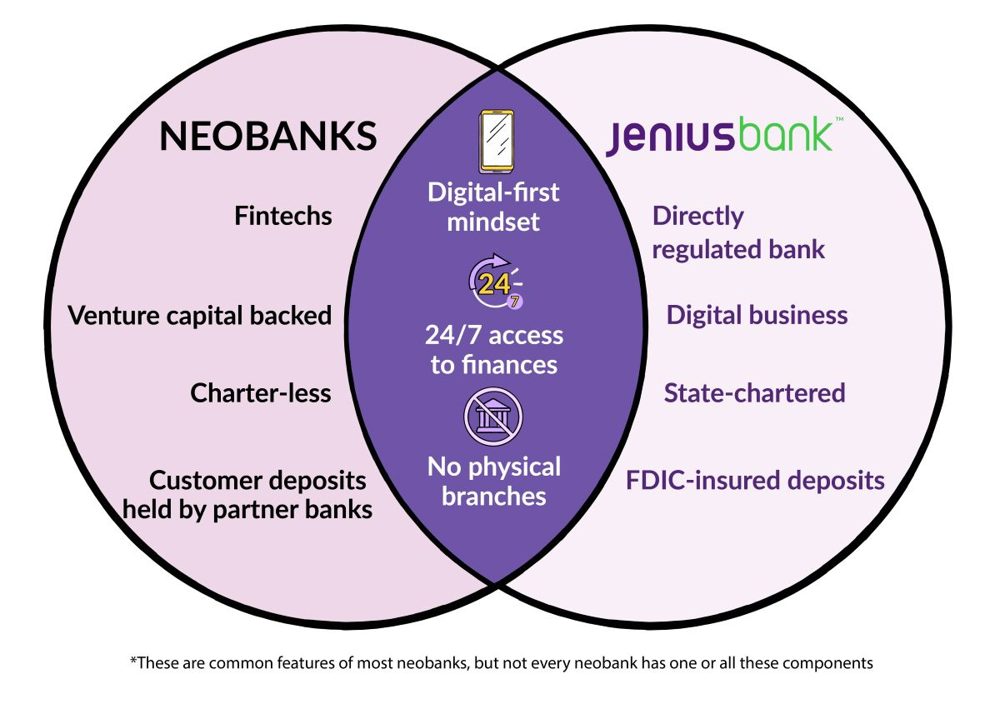
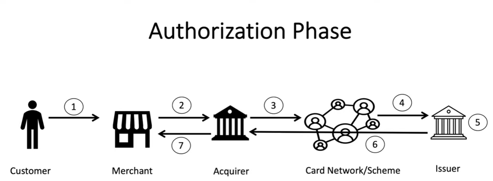
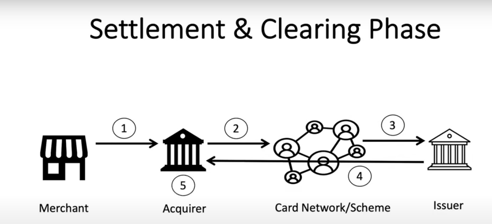

> What is difference between GraphQL vs Rest

| Features | GraphQL | REST |
| --- | --- | --- |
| Data Fetching | GraphQL allows fetching only the required data by specifying the required fields in the query | REST API fetches the entire data of a resource |
| Multiple Endpoints | GraphQL has a single endpoint for all the queries and mutations | REST API has multiple endpoints for each resource |
| Schema Definition | GraphQL has a schema that defines the data types and relationships between them | REST API does not have a defined schema |
| Versioning | GraphQL does not require versioning since it uses a schema | REST API requires versioning to maintain backward compatibility |
| Caching | GraphQL does not have built-in caching | REST API has built-in caching for faster data retrieval |
| Security | GraphQL supports query validation and authorization using directives | REST API uses tokens and cookies for authentication and authorization |
| Error Handling | GraphQL returns a structured error object with error code and message | REST API returns an HTTP status code and error message |
| Performance | GraphQL fetches only the required data, thus reducing network usage and improving performance | REST API fetches the entire data, even if it is not required, leading to network overhead and poor performance |
| Mobile Development | GraphQL is more suitable for mobile development since it allows fetching only the required data | REST API may not be suitable for mobile development due to network overhead and performance issues |
| Tooling | GraphQL has extensive tooling support for client and server development | REST API has limited tooling support compared to GraphQL |

> What is a Charter, and Why is it Important?

According to S&P Global, only four new banking charters were approved in 2022. It often takes a company three to five years to go through the intense chartering process.¹

> What are Neo Banks ?

They are a high-growth part of the fintech space and look the most like traditional and digital banks when compared to other fintechs.

Most neobanks differ from traditional and digital banks in a few key ways:

Neobanks don’t have a bank charter

They partner with chartered banks to provide services

They aren’t directly regulated and audited by banking examiners

> E-Payment (Card Payment)

> Settlement & Clearing Phase

