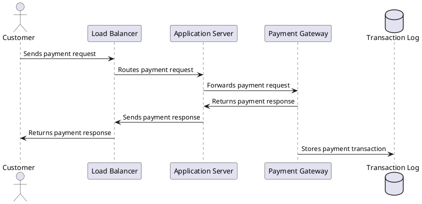

> Cap Theoram

CAP theorem states that a distributed system can't provide more than two of these three guarantees simultaneously.

𝐂𝐨𝐧𝐬𝐢𝐬𝐭𝐞𝐧𝐜𝐲: consistency means all clients see the same data at the same time no matter which node they connect to.

𝐀𝐯𝐚𝐢𝐥𝐚𝐛𝐢𝐥𝐢𝐭𝐲: availability means any client which requests data gets a response even if some of the nodes are down.

𝐏𝐚𝐫𝐭𝐢𝐭𝐢𝐨𝐧 𝐓𝐨𝐥𝐞𝐫𝐚𝐧𝐜𝐞: a partition indicates a communication break between two nodes. Partition tolerance means the system continues to operate despite network partitions.

> How do we design effective and safe APIs?

> what is the difference between post and patch in REST API

  | Feature | POST | PATCH |
      | --- | --- | --- |
  | Purpose | Create a new resource | Update an existing resource |
  | Idempotent | No | No (in general) |
  | Request Body | Required | Optional |
  | Request Body Content | Full representation of the resource | Only the updated fields or partial representation of the resource |
  | Response Status | 201 Created | 200 OK (or 204 No Content if no response body) |
  | Cacheable | No | Yes |
  | Use Case Example | Creating a new user account | Updating the email address of an existing user account |

  The main difference between POST and PATCH methods in REST API is the purpose and the nature of the request body. POST is used to create a new resource and requires a request body containing the full representation of the resource being created. On the other hand, PATCH is used to update an existing resource and only requires a request body containing the updated fields or a partial representation of the resource.

  In addition, POST requests are not idempotent, which means that sending the same request multiple times may result in multiple resources being created. PATCH requests are also not idempotent in general, but they can be made idempotent by adding a unique identifier in the request body.

  POST requests are typically used when creating a new user account, adding a new item to a shopping cart, or submitting a form. PATCH requests are used when updating the email address of an existing user account, changing the status of an order, or modifying a single field of a resource.
  
> Algorithms you should know before taking system design interview

> HTTP Status Codes

The response codes for HTTP are divided into five categories:

Informational (100-199)
Success (200-299)
Redirection (300-399)
Client Error (400-499)
Server Error (500-599)

> Difference between forward and reverse proxy

A forward proxy, or just proxy, is a server that shields user devices from the internet.

Use it to:
1️⃣ Protect your online identity
2️⃣ Sidestep browsing restrictions
3️⃣ Block access to unwanted content

A reverse proxy server forwards requests to web servers and returns results as if it processed the request.

Use it to:
1️⃣ Shield against DDoS attacks
2️⃣ Load balancing
3️⃣ Cache static contents
4️⃣ Offload TLS termination

> What is Cloud native

> What is SSO, or Single Sign-On?

With SSO, users can access many apps, such as Gmail, Slack, and Workday, without having to log in each time.
SAR => SAML Assertion Request

> Git Commands

> What are the API architectural styles?

1. REST
   Proposed in 2000, REST is the most used style. It is often used between front-end clients and back-end services. It is compliant with 6 architectural constraints. The payload format can be JSON, XML, HTML, or plain text.
2. GraphQL
   GraphQL was proposed in 2015 by Meta. It provides a schema and type system, suitable for complex systems where the relationships between entities are graph-like.
For example, in the diagram below, GraphQL can retrieve user and order information in one call, while in REST this needs multiple calls.
GraphQL is not a replacement for REST. It can be built upon existing REST services.
3. Web socket is a protocol that provides full-duplex communications over TCP. The clients establish web sockets to receive real-time updates from the back-end services. Unlike REST, which always “pulls” data, web socket enables data to be “pushed”.
4. Webhook
   Webhooks are usually used by third-party asynchronous API calls. In the diagram below, for example, we use Stripe or Paypal for payment channels and register a webhook for payment results.
   When a third-party payment service is done, it notifies the payment service if the payment is successful or failed. Webhook calls are usually part of the system’s state machine.
5. gRPC
   Released in 2016, gRPC is used for communications among microservices.
6. SOAP stands for Simple Object Access Protocol. Its payload is XML only, suitable for communications between internal systems

> How does foreign exchange in payments work? 

> What are the differences between a load balancer and an API gateway?

1️⃣ NLB (Network Load Balancer) is usually deployed before the API gateway, handling traffic routing based on IP. It does not parse the HTTP requests.
2️⃣ ALB (Application Load Balancer) routes requests based on HTTP header or URL and thus can provide richer routing rules. We can choose the load balancer based on routing requirements. For simple services with a smaller scale, one load balancer is enough.
3️⃣ The API gateway performs tasks more on the application level. So it has different responsibilities from the load balancer.

they are used in combination to provide a scalable and secure architecture for modern web apps.
- ALB is used to distribute requests among different services. Due to the fact that the services implement their own rating limitation, authentication, etc., this approach is more flexible but requires more work at the service level.
- An API gateway takes care of authentication, rate limiting, caching, etc., so there is less work at the service level. However, this option is less flexible compared with the ALB approach.

> What are the common load-balancing algorithms?

Static Algorithms
1. Round robin
   The client requests are sent to different service instances in sequential order. The services are usually required to be stateless.
2. Sticky round-robin
   This is an improvement of the round-robin algorithm. If Alice’s first request goes to service A, the following requests go to service A as well.
3. Weighted round-robin
   The admin can specify the weight for each service. The ones with a higher weight handle more requests than others.
4. Hash
   This algorithm applies a hash function on the incoming requests’ IP or URL.
Dynamic Algorithms
1. Least connections
   A new request is sent to the service instance with the least concurrent connections.
2. Least response time
   A new request is sent to the service instance with the fastest response time.

> Generic system design framework

Here is a simple but powerful, step-by-step framework we put together to help you crack system design interviews.

> High volume payment processing system in Paypal

Paypal payments handles around 10k transaction per second. 4 to 5 sec. 

This architecture consists of the following components:

1. **Customer:** The user who initiates the payment request.
2. **Load Balancer:** Distributes incoming payment requests across multiple application servers to ensure high availability and scalability.
3. **Application Server:** Receives payment requests from the load balancer and forwards them to the payment gateway for processing.
4. **Payment Gateway:** Processes payment requests and returns payment responses to the application server.
5. **Transaction Log:** Stores payment transactions for auditing and reconciliation purposes.

To handle high volumes of transactions, the system can have multiple instances of the application server and payment gateway running in parallel, with each instance capable of processing a subset of the total load. The load balancer can distribute incoming requests evenly across the available instances, and new instances can be added dynamically to handle spikes in traffic. The payment gateway can also use caching and other optimization techniques to minimize the processing time for each transaction.
In addition, the system can employ various security measures to ensure the safety of transactions and user data, such as SSL/TLS encryption, two-factor authentication, and fraud detection algorithms. The transaction log can be replicated across multiple data centers to ensure data redundancy and disaster recovery.

> How does VISA make money ?

The diagram below shows the economics of the credit card payment flow.

1. The cardholder pays a merchant $100 to buy a product.

2. The merchant benefits from the use of the credit card with higher sales volume, and needs to compensate the issuer and the card network for providing the payment service. The acquiring bank sets a fee with the merchant, called the “merchant discount fee”

3 - 4. The acquiring bank keeps $0.25 as the acquiring markup, and $1.75 is paid to the issuing bank as the interchange fee. The merchant discount fee should cover the interchange fee.

The interchange fee is set by the card network because it is less efficient for each issuing bank to negotiate fees with each merchant.

5. The card network sets up the network assessments and fees with each bank, which pays the card network for its services every month. For example, VISA charges a 0.11% assessment, plus a $0.0195 usage fee, for every swipe.

6. The cardholder pays the issuing bank for its services.

[Top 10 Architecture Characteristics / Non-Functional Requirements with Cheatsheet](https://blog.devgenius.io/top-10-architecture-characteristics-non-functional-requirements-with-cheatsheat-7ad14bbb0a9b)

[Design Patterns Card](http://www.mcdonaldland.info/files/designpatterns/designpatternscard.pdf)

[Batch and Stream Processing](https://www.linkedin.com/posts/alexxubyte_systemdesign-coding-interviewtips-activity-7048681837040168960-u0Is?utm_source=share&utm_medium=member_desktop)

