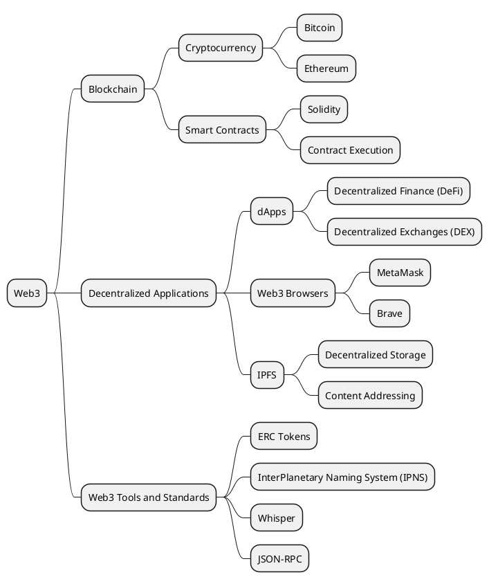
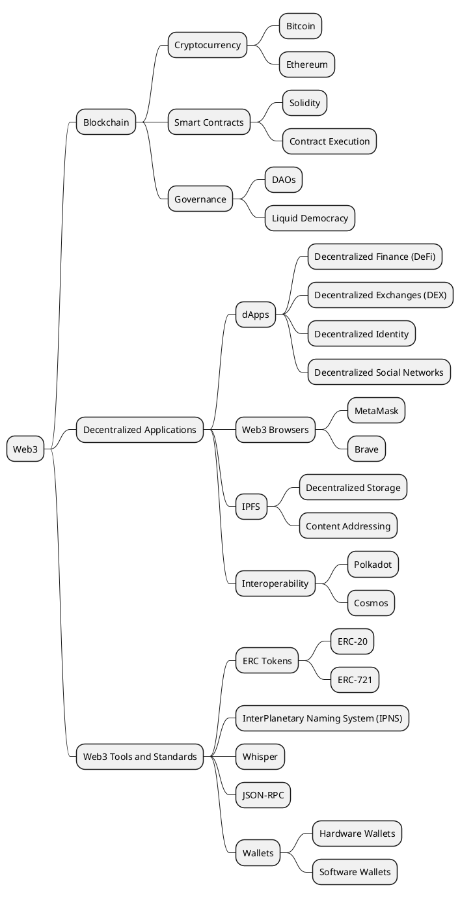

> what is web3?

Web3, also known as Web 3.0, refers to the next generation of the internet and the evolution of the current Web 2.0. The term "web3" is often used to describe a decentralized web, where users have more control over their data and identity.

Web3 technologies are based on blockchain and other decentralized technologies that enable the creation of distributed applications (dApps) and peer-to-peer networks. Web3 applications often rely on smart contracts, which are self-executing contracts with the terms of the agreement between buyer and seller being directly written into lines of code.

Web3 aims to create a more open and democratized internet, where users can own and control their data, and where trust and security are ensured through cryptography and decentralized consensus mechanisms. Some of the most well-known web3 applications include cryptocurrencies like Bitcoin and Ethereum, decentralized marketplaces like OpenBazaar, and social networks like Mastodon.

> how does web3 help in cloud platform

Web3 technologies can help in cloud platforms by providing decentralized and secure solutions for data storage and computation.

With web3, users can store their data on a decentralized network of nodes, rather than relying on a centralized cloud provider. This can increase security and reduce the risk of data breaches or loss, as the data is stored on multiple nodes and is encrypted using cryptography.

In addition, web3 can provide decentralized computation solutions through the use of smart contracts. These smart contracts can be used to execute complex computations across a decentralized network of nodes, rather than relying on a centralized cloud provider. This can increase efficiency and reduce costs, as well as providing more transparency and security.

Overall, web3 technologies can provide a more secure and decentralized approach to cloud computing, which can increase trust and reliability for users and organizations alike.

> Let's start by creating a simple MindMap on the topic of Web3. Can you give the mindmap in PlantUML format. Keep it structured from the core central topic branching out to other domains and sub-domains. Let's go to 4 levels to begin with. Add the start and end mindmap tags and keep it expanding on one side for now

diff



Here is the MindMap in PlantUML format, structured from the core central topic branching out to other domains and sub-domains:

diff


The MindMap has four levels, starting with the core central topic of Web3 and branching out to blockchain, decentralized applications, and web3 tools and standards. Each of these domains has sub-domains, such as cryptocurrency, smart contracts, and decentralized finance within blockchain, or decentralized storage, content addressing, and web3 browsers within decentralized applications. This MindMap can be used as a starting point for exploring the different areas of web3 and their relationships.

> Can you increase it by two more levels and add further domains

Sure! Here's an updated MindMap with two more levels and additional domains:

diff



In this updated MindMap, I've added two more levels and additional domains, including governance, decentralized identity, decentralized social networks, interoperability, and wallets. These domains are further sub-divided into DAOs, liquid democracy, decentralized storage, content addressing, Polkadot, Cosmos, ERC tokens, and hardware and software wallets, among others. This MindMap can serve as a more comprehensive overview of the different areas of web3 and how they relate to each other.

> Can you add colour codes to the above mind map? Use the format +\[#FFFF00\] Web3. The above is just an example; use your colour codes for each node based on the complexity of each node in terms of the time it takes to learn that topic for a beginner

Certainly! Here's an updated MindMap with color codes added based on the complexity of each node in terms of the time it takes to learn that topic for a beginner:

diff

```plantuml
@startmindmap
+[#FFD700] Web3
++ Blockchain
+++ Cryptocurrency
++++ Bitcoin
+++++[#FFFF00] Introduction
+++++[#FFFF00] Mining
+++++[#FFFF00] Transactions
++++ Ethereum
+++++[#FFFF00] Introduction
+++++[#FFA500] Smart Contracts
+++++[#FFA500] Contract Execution
+++++[#FFA500] Governance
+++++[#FFA500] DAOs
+++++[#FFA500] Liquid Democracy
+++ Decentralized Applications
++++ dApps
+++++[#FFA500] Introduction
+++++[#FFA500] Decentralized Finance (DeFi)
+++++[#FFA500] Decentralized Exchanges (DEX)
+++++[#FFA500] Decentralized Identity
+++++[#FFA500] Decentralized Social Networks
+++ Web3 Browsers
++++ MetaMask
+++++[#FFFF00] Introduction
+++++[#FFFF00] Setup
++++ Brave
+++++[#FFFF00] Introduction
+++++[#FFFF00] Features
+++ IPFS
++++ Decentralized Storage
+++++[#FFA500] Introduction
+++++[#FFA500] Content Addressing
+++ Interoperability
++++ Polkadot
+++++[#FFA500] Introduction
+++++[#FFA500] Cross-chain Communication
++++ Cosmos
+++++[#FFA500] Introduction
+++++[#FFA500] Tendermint
++ Web3 Tools and Standards
+++ ERC Tokens
++++ ERC-20
+++++[#FFFF00] Introduction
+++++[#FFFF00] Implementation
++++ ERC-721
+++++[#FFFF00] Introduction
+++++[#FFFF00] Implementation
+++ InterPlanetary Naming System (IPNS)
+++++[#FFFF00] Introduction
+++++[#FFFF00] Setup
+++ Whisper
+++++[#FFFF00] Introduction
+++++[#FFFF00] Messaging
+++ JSON-RPC
+++++[#FFFF00] Introduction
+++++[#FFFF00] Implementation
+++ Wallets
@endmindmap
```

In this updated MindMap, each node has been assigned a color code based on the complexity of the topic. The color codes range from a lighter shade of yellow for introductory topics to a darker shade of orange for more complex topics. For example, Bitcoin has been assigned a light yellow color as an introductory topic, while smart contracts and governance within Ethereum have been assigned a darker shade of orange as more complex topics. The color codes can help learners identify which topics may require more time and effort to learn and understand.