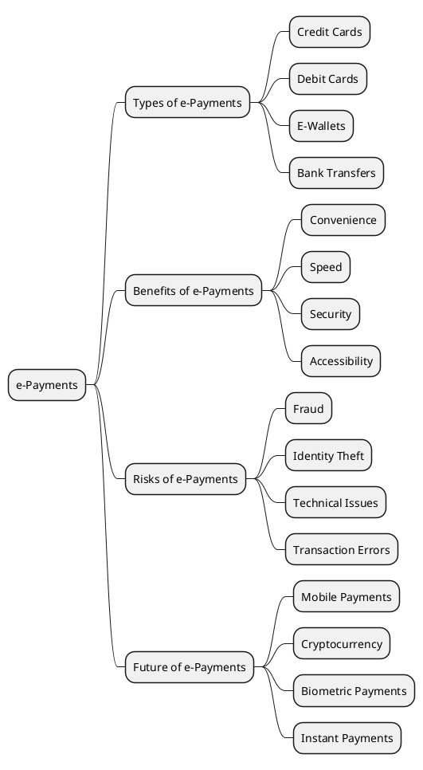
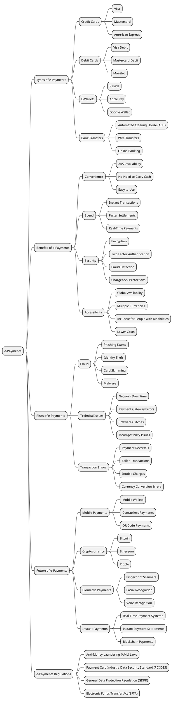
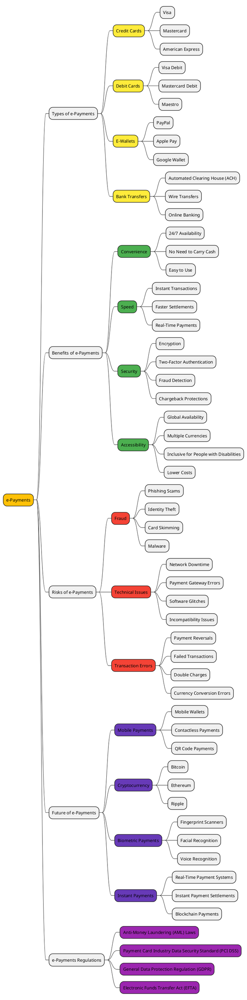

> What's a mindmap

A mind map is a visual tool that is used to organize, structure and analyze information. It is a diagram that is used to represent ideas, concepts, or tasks, and the relationships between them. The basic structure of a mind map consists of a central idea or theme, which is placed at the center of the map, with related ideas branching out from it.

The branches of a mind map can be further divided into sub-branches, which represent more detailed information about the main idea. The structure of a mind map is designed to help individuals think creatively and visually, and to identify relationships and connections between different ideas.

Mind maps are often used for brainstorming, note-taking, problem-solving, planning, and organizing information. They are commonly used in education, business, and personal development as a tool for improving creativity, memory retention, and productivity. Mind mapping software is also available that allows individuals to create and edit mind maps digitally.

> 4 / 4
> 
> Okay, Let's start by creating a simple MindMap on the topic of e-Payments. Can you give the mindmap in PlantUML format. Keep it structured from the core central topic branching out to other domains and sub-domains. Let's go to 4 levels to begin with. Add the start and end mindmap tags and keep it expanding on one side for now

Sure, here's a simple MindMap on the topic of e-Payments using PlantUML format:

diff

In this MindMap, the central topic is e-Payments and it branches out into four main domains, which are Types of e-Payments, Benefits of e-Payments, Risks of e-Payments, and Future of e-Payments. Each of these domains further branches out into sub-domains, providing more detail and structure to the overall topic. The MindMap is structured to expand on one side, with the main domains branching out horizontally and the sub-domains branching out vertically.

> Can you increase it by two more levels and add further domains

Sure, here's an expanded version of the e-Payments MindMap with two additional levels and more domains:

markdown

In this expanded MindMap, each of the four main domains has been expanded into sub-domains, and there are now two additional levels of detail. The sub-domains are now more specific, providing more detail about different types of e-Payments, their benefits, risks, and future developments. There is also a new domain on e-Payments Regulations, which includes information about the legal and regulatory frameworks governing e-Payments.

> 2 / 2
> 
> Can you add colour codes to the above mind map? Use the format \* \[#FFFF00\] e-Payments. The above is just an example; use your colour codes for each node based on the complexity of each node in terms of the time it takes to learn that topic for a beginner

2 / 2

Sure, here's an updated version of the e-Payments MindMap with color codes assigned to each node:

markdown

In this updated MindMap, I have used a color scheme to indicate the complexity of each node in terms of the time it takes to learn that topic for a beginner. The more complex nodes are assigned a darker color, while the simpler nodes are assigned a lighter color. For example, the central node "e-Payments" is assigned a bright yellow color, while the more complex nodes like "Fraud" and "Technical Issues" are assigned a darker red color. This color scheme helps to visually organize the MindMap and make it easier to understand for beginners.