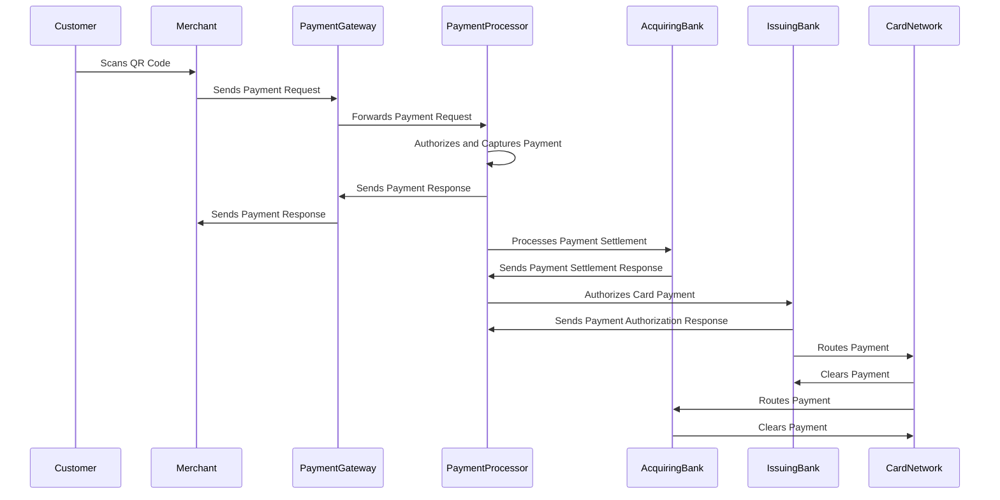

> lets define a simple use case in QR Code payment by Paypal, something that is very well established and easy to understand

Sure, here's a simple use case for QR code payment using PayPal:

Suppose you're a small business owner and you'd like to offer your customers a convenient way to pay using their PayPal accounts. You can create a QR code that links to your PayPal account, which your customers can scan using their smartphones.

Here are the steps:

1.  Log in to your PayPal account and generate a QR code. You can do this by going to the "QR Codes" section of the PayPal app or website and selecting "Create QR Code."
    
2.  Print the QR code and display it prominently in your store or on your website.
    
3.  When a customer is ready to make a payment, they can open their PayPal app and scan the QR code using their smartphone camera.
    
4.  The app will automatically recognize the PayPal account linked to the QR code and prompt the customer to confirm the payment amount.
    
5.  The customer can then confirm the payment and complete the transaction.
    
6.  You will receive a notification on your PayPal account that the payment has been made, and the funds will be transferred to your PayPal balance.
    

This is a simple and convenient way to accept payments from customers who prefer to use PayPal, without the need for any additional hardware or software.

> Let’s define a Data Model for the use-case

Sure, here's a data model for the QR code payment use case using PayPal:

1.  User: This represents a user of the PayPal app or website who wants to make a payment using QR code.
    
    *   User ID: Unique identifier for the user.
    *   First Name: The user's first name.
    *   Last Name: The user's last name.
    *   Email: The user's email address.
    *   Password: The user's password to access their PayPal account.
2.  Merchant: This represents the small business owner who wants to accept payments using a QR code.
    
    *   Merchant ID: Unique identifier for the merchant.
    *   Business Name: The name of the merchant's business.
    *   Email: The email address associated with the merchant's PayPal account.
3.  Payment: This represents a payment made by a user to a merchant using a QR code.
    
    *   Payment ID: Unique identifier for the payment.
    *   Payment Amount: The amount of the payment.
    *   Payment Status: The status of the payment (e.g. Pending, Completed, Failed).
    *   Payment Date: The date the payment was made.
    *   User ID: The unique identifier of the user who made the payment.
    *   Merchant ID: The unique identifier of the merchant who received the payment.
4.  QR Code: This represents the QR code generated by the merchant for users to scan and make payments.
    
    *   QR Code ID: Unique identifier for the QR code.
    *   QR Code Image: The image of the QR code.
    *   Merchant ID: The unique identifier of the merchant who generated the QR code.

This data model captures the essential entities and relationships involved in the QR code payment use case using PayPal. It provides a foundation for building the database and implementing the necessary functionalities to enable the use case.

> describe the data model in more detail or tabular format using markdown

Sure, here's the data model in tabular format using markdown:

### User

| Field | Data Type | Description |
| --- | --- | --- |
| User ID | Integer | Unique identifier for the user. |
| First Name | String | The user's first name. |
| Last Name | String | The user's last name. |
| Email | String | The user's email address. |
| Password | String | The user's password to access their PayPal account. |

### Merchant

| Field | Data Type | Description |
| --- | --- | --- |
| Merchant ID | Integer | Unique identifier for the merchant. |
| Business Name | String | The name of the merchant's business. |
| Email | String | The email address associated with the merchant's PayPal account. |

### Payment

| Field | Data Type | Description |
| --- | --- | --- |
| Payment ID | Integer | Unique identifier for the payment. |
| Payment Amount | Decimal | The amount of the payment. |
| Payment Status | String | The status of the payment (e.g. Pending, Completed, Failed). |
| Payment Date | Date | The date the payment was made. |
| User ID | Integer | The unique identifier of the user who made the payment. |
| Merchant ID | Integer | The unique identifier of the merchant who received the payment. |
| Payment Method | String | The method of payment (e.g. PayPal account, credit card, debit card, bank account, etc.). |
| Transaction ID | String | The transaction ID generated by PayPal for the payment. |

### QR Code

| Field | Data Type | Description |
| --- | --- | --- |
| QR Code ID | Integer | Unique identifier for the QR code. |
| QR Code Image | Image | The image of the QR code. |
| Merchant ID | Integer | The unique identifier of the merchant who generated the QR code. |

This tabular format provides a detailed description of each field in each entity of the data model for the QR code payment use case using PayPal.

> this is perfect, I would like to depict the relationships in a mermaid diagram, can you give me the markdown code to do this

Sure, here's the markdown code for a mermaid diagram depicting the relationships in the data model:

css

This mermaid diagram depicts the relationships between the entities in the data model for the QR code payment use case using PayPal. Specifically, it shows that a user makes a payment to a merchant, which is received by the merchant. The user initiates the payment using a QR code, which is generated by the merchant. The merchant can have multiple QR codes, and the user can initiate multiple payments. Each payment is associated with a user and received by a merchant.

> how would a QA Code transaction impact the tables mentioned above, I would like to depict this as a sequence diagram. Can you help describe the diagram in markdown format for mermaid

Sure, here's a sequence diagram in markdown format using Mermaid that depicts a QR Code transaction and its impact on the tables mentioned above:

rust

This sequence diagram depicts the flow of events in a QR Code transaction and its impact on the tables mentioned above. Specifically, it shows that the user scans the QR code generated by the merchant, which triggers the merchant to generate a payment request to PayPal. PayPal then sends the payment request to the merchant, who displays the payment details to the user. The user confirms the payment, which triggers the merchant to confirm the payment to PayPal. PayPal then sends the payment confirmation to the merchant. This sequence of events would result in the creation of a new payment record in the Payment table with the associated User ID and Merchant ID, as well as a new QR Code record in the QR Code table associated with the Merchant ID.

> How would the QA code payment flow work for Paypal? I would like to depict the states in a state diagram using mermaid. Can you help describe the diagram in markdown format

Sure, here's a state diagram in markdown format using Mermaid that depicts the QR code payment flow for PayPal:

sql

This state diagram depicts the states in the QR code payment flow for PayPal. Initially, the system is in a "Ready" state. When the user scans the QR code, the system transitions to the "GeneratingPaymentRequest" state, where the payment request is generated by the merchant and sent to PayPal. Once the payment request is sent, the system transitions to the "PaymentRequestSent" state, where the payment details are received by the merchant. The system then transitions to the "PaymentDetailsDisplayed" state, where the payment details are displayed to the user. If the user confirms the payment, the system transitions to the "Confirmed" state, where the payment is confirmed by the merchant and sent to PayPal. If the payment is successful, the system transitions to the "PaymentSuccessful" state, and if the payment is cancelled, the system transitions to the "PaymentCancelled" state. Finally, the system transitions back to the "Ready" state to await the next payment request.

> please include payment flow with authorization and capture states as well as payment processor and payment gateway as well

Sure, here's an updated state diagram in markdown format using Mermaid that depicts the QR code payment flow with authorization and capture states, as well as payment processor and payment gateway:

sql

This state diagram depicts the updated QR code payment flow with authorization and capture states, as well as payment processor and payment gateway. Initially, the system is in a "Ready" state. When the user scans the QR code, the system transitions to the "GeneratingPaymentRequest" state, where the payment request is generated by the merchant and sent to the payment processor and payment gateway. If the payment request is successful, the system transitions to the "PaymentRequestSent" state, where the payment details are received by the merchant. The system then transitions to the "PaymentDetailsDisplayed" state, where the payment details are displayed to the user. If the user authorizes the payment, the system transitions to the "PaymentAuthorized" state, where the payment is authorized by the payment processor. If the payment is successfully authorized, the system transitions to the "PaymentCaptured" state, where the payment is captured by the payment processor. If the payment is captured successfully, the system transitions to the "PaymentSuccessful" state. If the payment authorization fails, the system transitions to the "PaymentVoided" state, where the payment is voided. If the payment capture fails, the system transitions to the "PaymentCaptureFailed" state, where the payment is voided. If the user cancels the payment, the system transitions to the "PaymentCancelled" state. If the payment request fails, the system transitions to the "PaymentRequestFailed" state. If the payment is refunded, the system transitions to the "PaymentRefunded" state. If the payment authorization expires, the system transitions to the "PaymentExpired" state. Finally, the system transitions back to the "Ready" state to await the next payment request.

> Let’s start by creating a context diagram of the services in QR Code Payment flow

Sure, here's a context diagram in Mermaid markdown format that depicts the services involved in a QR code payment flow:

lua

This context diagram depicts the four main services involved in a QR code payment flow: the merchant, the payment gateway, the payment processor, and the customer. The merchant generates the QR code payment request and receives the payment from the payment processor via the payment gateway. The payment gateway processes the payment request and communicates with both the merchant and the payment processor. The payment processor authorizes and captures the payment and communicates with the payment gateway. Finally, the customer scans the QR code to initiate the payment flow. The arrows depict the flow of information between the services.

> please include acquiring bank, issuing bank, card network as well in the diagram

Sure, here's an updated context diagram in Mermaid markdown format that depicts the acquiring bank, issuing bank, and card network in addition to the services involved in a QR code payment flow:

sql

This updated context diagram depicts the acquiring bank, issuing bank, and card network in addition to the four main services involved in a QR code payment flow: the merchant, the payment gateway, the payment processor, and the customer. The acquiring bank processes the payment settlement and communicates with the payment processor, while the issuing bank handles the card issuance and authorization and communicates with the payment processor and the card network. The card network handles payment routing and clearing between the issuing bank and acquiring bank, and communicates with both banks. The arrows depict the flow of information between the services.

> regenerate the diagram using latest syntax of Mermaid markdown

Sure, here's the context diagram again using the latest syntax for Mermaid markdown:

mermaid

This diagram is the same as the previous one, but uses the latest Mermaid syntax.

> Add legands for each of the links in the graph above

Sure, here's the context diagram again with legends for each of the links:

mermaid

In this updated diagram, legends have been added for each of the links between the services, describing the action being taken by the service or the information being communicated.

> Add sequence of steps for legand in the diagram above

Sure, here's the context diagram again with a sequence of steps for each legend:

mermaid

In this updated diagram, a sequence of steps has been added for each legend to provide more detail on the specific actions or communications taking place between the services.

> Realign the diagram such that the sequence of steps in the diagram appears in correct order and looks aesthetically pleasant

Sure, here's the diagram with the sequence of steps in the correct order and a more aesthetically pleasing layout:

mermaid

In this updated diagram, the services are organized in a more visually pleasing way, and the sequence of steps flows from top to bottom in the correct order.

> generate sequence diagram with details of all the components involved in QR code payment

Sure, here's a sequence diagram that includes all the components involved in QR code payment and their interactions:

mermaid

In this diagram, each component involved in the QR code payment process is represented as a participant, and their interactions are shown using arrows and messages. The sequence of steps is the same as in the previous diagrams, but this diagram focuses on the specific components involved in each step.

> correct the payment flow such that authorization occurs first before sending the payment confirmation. Also add sequence numbers to each step

Sure, here's an updated sequence diagram that corrects the payment flow so that authorization occurs before sending the payment confirmation, and adds sequence numbers to each step:

mermaid

In this updated diagram, the payment flow is corrected so that authorization occurs before sending the payment confirmation. Each step is numbered to indicate the sequence of events in the payment process.

> denote QR Code payment as seperate flow from payment settlement which occurs at the end of the day.

Sure, here's an updated sequence diagram that separates the QR code payment flow from the payment settlement process that occurs at the end of the day:

mermaid

In this updated diagram, the QR code payment flow is separated from the payment settlement process that occurs at the end of the day. The settlement process is shown as a loop, indicating that it occurs repeatedly throughout the day. The SettlementProcessor participant is added to represent the component that initiates the payment settlement process.

> who will initiate the payment settlement at the end of the day. Is it the payment processor or the acquiring bank. Update the diagram accordingly

Typically, the payment settlement process is initiated by the acquiring bank at the end of the day. Here's an updated sequence diagram that reflects this:

mermaid

In this updated diagram, the SettlementProcessor participant has been removed and the AcquiringBank participant initiates the payment settlement process at the end of the day.

> create a new sequence diagram only for the payment settlement at the end of day

Here's a sequence diagram for the payment settlement process at the end of the day:

mermaid

This diagram shows the payment settlement process that occurs at the end of the day. The AcquiringBank initiates the process by sending a request to the SettlementProcessor, which responds with a payment settlement confirmation. The payment settlement process then involves the IssuingBank, CardNetwork, and AcquiringBank clearing and routing payments between each other.

> give me the sequence digram for QR Code payment with mobile wallet integration

Here's a sequence diagram for QR Code payment with mobile wallet integration:

mermaid

This diagram is similar to the previous QR Code payment diagram, but with the addition of the MobileWallet participant. The payment flow begins with the customer selecting a payment method in their mobile wallet and the mobile wallet displaying a QR Code. The customer then scans the QR Code with the merchant's device and the payment process proceeds as before. The payment settlement process at the end of the day is the same as before as well.