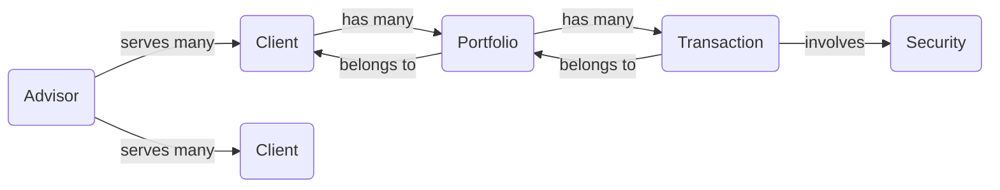
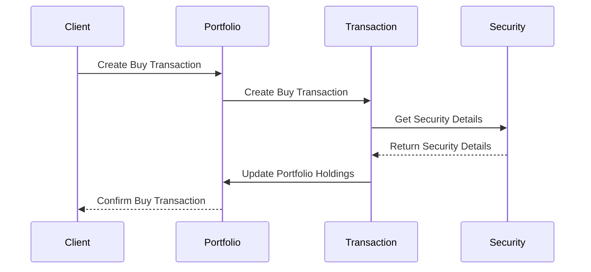

**[Using ChatGPT to build System Diagrams — Part I](https://aruva.medium.com/using-chatgpt-to-build-system-diagrams-part-i-69efc7603926)**

*Step 1: Let’s define the use-case*


> lets define a simple use case in wealth management, something that is very well established and easy to understand

---

Sure, a simple use case in wealth management could be an individual who wants to invest a portion of their savings into the stock market.

For example, let's say that John has $10,000 in savings that he wants to invest in the stock market. John has heard that investing in the stock market can provide a good return on investment over the long-term, but he doesn't know where to start.

John could go to a wealth management firm or a financial advisor to get help with his investment. The financial advisor would first assess John's financial situation, including his income, expenses, debts, and investment goals. Based on this information, the advisor would recommend an investment strategy that is suitable for John's risk tolerance and investment objectives.

The advisor might recommend a diversified portfolio of stocks and bonds that are tailored to John's investment objectives and risk tolerance. The advisor would also help John to monitor his investments and adjust his portfolio as needed over time.

In this use case, the goal of the wealth management service is to help John to invest his money wisely and grow his wealth over the long-term while minimizing his risk.

*Step 2: Let’s define a Data Model for the use-case*
---

> Let’s define a Data Model for the use-case

---

Sure, here is a possible data model for the use case:

Entities:

*   Client: represents a client who wants to invest in the stock market. It has attributes such as name, age, income, expenses, and investment goals.
*   Portfolio: represents a collection of assets owned by the client, such as stocks, bonds, and mutual funds. It has attributes such as name, type, and value.
*   Transaction: represents a transaction made by the client, such as buying or selling a stock. It has attributes such as type (buy/sell), date, quantity, price, and fees.
*   Advisor: represents the financial advisor who provides wealth management services to the client. It has attributes such as name, credentials, and contact information.

Relationships:

*   A client has one or more portfolios.
*   A portfolio belongs to one client.
*   A portfolio has one or more transactions.
*   A transaction belongs to one portfolio.
*   An advisor serves one or more clients.
*   A client is served by one advisor.

The data model can be represented graphically as follows:

lua

    ```lua
+--------+         +--------------+
    | Client |---------|    Advisor   |
    +--------+         +--------------+
         |                      |
         | has many             | serves many
         |                      |
    +--------+         +--------------+         +--------------+
    |Portfolio|---------|  Transaction |---------|   Security   |
    +--------+         +--------------+         +--------------+
```

In this data model, a client can have multiple portfolios, and each portfolio can have multiple transactions. The security entity represents the stocks, bonds, and other financial instruments that are part of the transactions in the portfolio. The advisor entity represents the financial advisor who provides wealth management services to the client.

* I wanted to drill a bit deeper on the data model so my next prompt was *
---

> describe the data model in more detail or tabular format using markdown

---

Sure! Here's a more detailed description of the data model using a tabular format in Markdown:

Client
------

Represents a client who wants to invest in the stock market.

```
| Attribute | Type | Description |
| --- | --- | --- |
| id | Integer | Unique identifier for the client. |
| name | String | Full name of the client. |
| age | Integer | Age of the client. |
| income | Float | Annual income of the client. |
| expenses | Float | Annual expenses of the client. |
| investment\_goals | String | Investment goals of the client, such as retirement or saving for a down payment. |
```

Portfolio
---------

Represents a collection of assets owned by the client, such as stocks, bonds, and mutual funds.

```
| Attribute | Type | Description |
| --- | --- | --- |
| id | Integer | Unique identifier for the portfolio. |
| client\_id | Integer | Identifier of the client who owns the portfolio. |
| name | String | Name of the portfolio. |
| type | String | Type of the portfolio, such as stocks or bonds. |
| value | Float | Total value of the portfolio. |
```

Transaction
-----------

Represents a transaction made by the client, such as buying or selling a stock.

```
| Attribute | Type | Description |
| --- | --- | --- |
| id | Integer | Unique identifier for the transaction. |
| portfolio\_id | Integer | Identifier of the portfolio that the transaction belongs to. |
| security\_id | Integer | Identifier of the security involved in the transaction. |
| type | String | Type of the transaction, such as buy or sell. |
| date | Date | Date of the transaction. |
| quantity | Integer | Quantity of the security involved in the transaction. |
| price | Float | Price of the security at the time of the transaction. |
| fees | Float | Fees charged for the transaction. |
```

Security
--------

Represents a financial instrument that can be bought or sold in a transaction.

```
| Attribute | Type | Description |
| --- | --- | --- |
| id | Integer | Unique identifier for the security. |
| name | String | Name of the security, such as the name of a stock. |
| type | String | Type of the security, such as stocks or bonds. |
| issuer | String | Name of the issuer of the security, such as the company that issued a stock. |
```

Advisor
-------

Represents the financial advisor who provides wealth management services to the client.

```
| Attribute | Type | Description |
| --- | --- | --- |
| id | Integer | Unique identifier for the advisor. |
| name | String | Full name of the advisor. |
| credentials | String | Professional credentials of the advisor, such as CFP or CPA. |
| contact\_info | String | Contact information for the advisor, such as phone number or email. |
```

In this data model, the Client entity has a one-to-many relationship with the Portfolio entity, meaning that a client can have multiple portfolios, but each portfolio belongs to only one client. The Portfolio entity has a one-to-many relationship with the Transaction entity, meaning that a portfolio can have multiple transactions, but each transaction belongs to only one portfolio. The Security entity is involved in transactions and can be shared across multiple portfolios. The Advisor entity has a many-to-many relationship with the Client entity, meaning that an advisor can serve multiple clients, and a client can be served by multiple advisors.

---

* Step 3: Let’s define relationships — Entity Relationship Diagram *


> this is perfect, I would like to depict the relationships in a mermaid diagram, can you give me the markdown code to do this

---

Sure, here's the Markdown code for a Mermaid diagram that depicts the relationships in the data model:

scss

```scss
graph LR
    A(Client) -- has many --> B(Portfolio)
    B -- belongs to --> A
    B -- has many --> C(Transaction)
    C -- belongs to --> B
    C -- involves --> D(Security)
    E(Advisor) -- serves many --> A
    E -- serves many --> F(Client)
```

This will produce a diagram that looks like this:

lua

```lua
+--------+         +--------------+
| Client |---------|    Advisor   |
+--------+         +--------------+
     |                      |
has many             serves many
     |                      |
+--------+         +--------------+         +--------------+
|Portfolio|---------|  Transaction |---------|   Security   |
+--------+         +--------------+         +--------------+
```

In this diagram, each entity is represented by a box, and the relationships are represented by arrows. The arrowhead points from the "many" side of the relationship to the "one" side. For example, the "Client" entity has a "has many" relationship with the "Portfolio" entity, so the arrowhead points from "Client" to "Portfolio". Similarly, the "Portfolio" entity has a "belongs to" relationship with the "Client" entity, so the arrowhead points from "Portfolio" to "Client".

---

> this is perfect, I would like to depict the relationships in a mermaid diagram, can you give me the markdown code to do this

---

Sure, here's the Markdown code for a Mermaid diagram that depicts the relationships in the data model:

scss



This will produce a diagram that looks like this:

lua

```lua
+--------+         +--------------+
| Client |---------|    Advisor   |
+--------+         +--------------+
     |                      |
has many             serves many
     |                      |
+--------+         +--------------+         +--------------+
|Portfolio|---------|  Transaction |---------|   Security   |
+--------+         +--------------+         +--------------+
```

In this diagram, each entity is represented by a box, and the relationships are represented by arrows. The arrowhead points from the "many" side of the relationship to the "one" side. For example, the "Client" entity has a "has many" relationship with the "Portfolio" entity, so the arrowhead points from "Client" to "Portfolio". Similarly, the "Portfolio" entity has a "belongs to" relationship with the "Client" entity, so the arrowhead points from "Portfolio" to "Client".

* Step 4: Sequence Diagram *


---

> how would a Buy transaction for an asset impact the tables mentioned above, I would like to depict this as a sequence diagram. Can you help describe the diagram in markdown format for mermaid

---

Sure, here's a Markdown code for a Mermaid sequence diagram that depicts how a Buy transaction for an asset would impact the tables mentioned above:

rust



In this sequence diagram, the steps involved in creating a Buy transaction are shown as messages exchanged between the different participants: "Client", "Portfolio", "Transaction", and "Security".

The diagram starts with the "Client" creating a Buy transaction by sending a message to the "Portfolio". The "Portfolio" then creates a Buy transaction in the "Transaction" table and sends a message to the "Transaction" participant. The "Transaction" participant then retrieves the details of the security being bought from the "Security" table by sending a message. The "Security" table returns the security details as a message response. The "Transaction" participant then updates the "Portfolio" table with the new holdings by sending a message to the "Portfolio" participant. Finally, the "Portfolio" participant confirms the transaction with the "Client" by sending a message.

This sequence diagram illustrates the flow of messages and the order in which different participants interact with each other during the creation of a Buy transaction.

* Step 5: State Transition Diagram *

---

> Will the account have states like new, closed, active inactive etc? I would like to depict the states in a state diagram using mermaid. Can you help describe the diagram in markdown format

---

Sure, here's a Markdown code for a Mermaid state diagram that depicts the different states that an account can have:

sql

```sql
stateDiagram-v2
    [*] --> New
    New --> Active: Open Account
    Active --> Inactive: Client Inactivity
    Inactive --> Active: Client Activity
    Active --> Closed: Client Request
    Inactive --> Closed: Client Request
    Closed --> [*]: Account Closed
```

In this state diagram, the different states that an account can have are represented by boxes, and the arrows represent the transitions between these states. The diagram starts with an initial state represented by the `[*]` symbol. From this initial state, the account can transition to the "New" state when a new account is created.

From the "New" state, the account can transition to the "Active" state when the account is opened by the client. From the "Active" state, the account can transition to the "Inactive" state if there is no activity from the client for a certain period of time. From the "Inactive" state, the account can transition back to the "Active" state if there is activity from the client.

The account can also transition to the "Closed" state from either the "Active" or "Inactive" state if the client requests to close the account. Finally, from the "Closed" state, the account transitions back to the initial state represented by the `[*]` symbol.

This state diagram illustrates the different states that an account can have and the possible transitions between these states based on various events.

---

> can you try giving the state diagram markdown syntax in new format using \[\*\]

---

Sure, here's the Markdown code for a state diagram in the new format:

sql

```sql
stateDiagram-v2
    [*] --> New
    New --> Active : Open Account
    Active --> Inactive : Client Inactivity
    Inactive --> Active : Client Activity
    Active --> Closed : Client Request
    Inactive --> Closed : Client Request
    Closed --> [*] : Account Closed
```

This code will produce the same state diagram as before, with the different states represented by boxes and the transitions between them represented by arrows. The `[*]` symbol represents the initial state, and the different states are labeled with their names.

---

> please include expired, frozen and other relevant states as well

---

Sure, here's an updated Markdown code for a state diagram that includes additional states that may be relevant in a wealth management use case:

sql

```sql
stateDiagram-v2
    [*] --> New
    New --> Active : Open Account
    Active --> Inactive : Client Inactivity
    Inactive --> Active : Client Activity
    Active --> Closed : Client Request
    Inactive --> Closed : Client Request
    Active --> Frozen : Client Request
    Frozen --> Active : Client Request
    Active --> Expired : Account Expires
    Expired --> Closed : Client Request
    Expired --> Inactive : Client Inactivity
    Expired --> [*] : Account Closed
```

In this updated state diagram, the additional states of "Frozen" and "Expired" have been included. The "Frozen" state represents an account that has been frozen by the client, typically due to a security breach or other concerns. The "Expired" state represents an account that has reached its expiration date.

When an account is frozen, it transitions from the "Active" state to the "Frozen" state, and can transition back to the "Active" state when the freeze is lifted. When an account expires, it can transition to either the "Closed" state or the "Inactive" state, depending on whether the client requests to close the account or not.

This updated state diagram provides a more comprehensive representation of the different states that an account can have in a wealth management use case.

---

[Using ChatGPT to build system diagrams — Part II](https://aruva.medium.com/using-chatgpt-to-build-system-diagrams-part-ii-a17d02f0dcb7)

> Going forward, I want you to act as a software architect and build C4 diagrams using mermaid.js. Keep the answers to markdown syntax and always keep in mind software functional and non-functional aspects including but not limited to scalability, availability, redundancy, containerization, security and disaster recovery.

---

Sure, as a software architect, I can create C4 diagrams using Mermaid.js to represent the different aspects of the system architecture, including functional and non-functional requirements such as scalability, availability, redundancy, containerization, security, and disaster recovery. Here are some examples:

System Context Diagram
----------------------

The system context diagram provides an overview of the system and its interactions with external systems and users.

css

```css
graph LR
  subgraph "External Systems"
    A[Banking System] -->|requests| B[Wealth Management System]
    C[Market Data Provider] -->|provides| B
  end
  subgraph "Users"
    D[Client] -->|uses| B
  end
```

In this system context diagram, the external systems that interact with the wealth management system are the banking system and the market data provider. The clients are the primary users of the system.

Container Diagram
-----------------

The container diagram shows the different containers that make up the system and their interactions.

lua

```lua
graph LR
  subgraph "Infrastructure"
    I[Load Balancer] --> C[Web Server]
    C --> D[Application Server]
    D --> E[Database Server]
  end
  subgraph "Containers"
    A[Web Application] --> C
    B[API Server] --> D
  end
  subgraph "External Systems"
    F[Market Data API] --> B
    G[Payment Gateway] --> A
  end
  subgraph "Users"
    H[Client Browser] --> A
  end
```

In this container diagram, the infrastructure consists of a load balancer, web server, application server, and database server. The containers include a web application and an API server, which interact with the external systems (market data API and payment gateway) and the users (client browser).

Component Diagram
-----------------

The component diagram provides a more detailed view of the system components and their interactions.

sql

```sql
graph LR
  subgraph "Web Application"
    A[Client-Side JavaScript] --> B[AngularJS]
    B --> C[Web API Client]
  end
  subgraph "API Server"
    D[Web API] --> E[Authentication Service]
    D --> F[Portfolio Service]
    D --> G[Transaction Service]
    E --> H[User Service]
  end
  subgraph "Database"
    I[Portfolio Data] --> F
    I --> G
    J[User Data] --> H
  end
  subgraph "External Systems"
    K[Market Data API] --> F
    L[Payment Gateway] --> C
  end
```

In this component diagram, the web application consists of client-side JavaScript and AngularJS components that interact with the web API client. The API server includes web API components for authentication, portfolio management, and transaction management, as well as a user service for managing user data. The database contains portfolio and user data. External systems include the market data API and payment gateway, which interact with the portfolio management and web API client components, respectively.

Deployment Diagram
------------------

The deployment diagram shows the physical deployment of the system components and their interactions.

lua

```lua
graph LR
  subgraph "Production Environment"
    subgraph "Web Server"
      A[Web Application] --> B[Docker Container]
      B --> C[Load Balancer]
    end
    subgraph "Application Server"
      D[API Server] --> E[Docker Container]
      E --> F[Docker Container]
      F --> G[Database Server]
    end
    subgraph "External Systems"
      H[Market Data API] --> D
      I[Payment Gateway] --> B
    end
  end
  sub
```

* The Context Diagram *
---

> Let’s start by creating a context diagram of the services in Wealth Management

---

Sure, here is a context diagram of the services in Wealth Management using Mermaid syntax:

css

```css
graph LR
  subgraph "Wealth Management"
    A[Client] -->|uses| B[Web Application]
    B -->|communicates with| C[API Server]
    C -->|accesses data from| D[Database Server]
  end
```

In this context diagram, the Wealth Management system consists of three main components: the client, the web application, and the API server. The client interacts with the web application, which communicates with the API server. The API server accesses data from the database server to provide services to the client through the web application.

* The Container Diagram *

---

> Let’s take the Portfolio service and break it down by creating a container diagram for its sub-functionalities

---

Sure, here's a container diagram for the Portfolio service using Mermaid syntax:

css

```css
flowchart LR
  subgraph "Wealth Management"
    subgraph "Portfolio Service"
      A[Web Application] --> B[API Server]
      B --> C[Database]
      D[External Trading API] --> B
    end
    subgraph "Supporting Services"
      E[Authentication Service]
      F[Notification Service]
    end
  end
```

In this container diagram, the Portfolio service is composed of three main components: the web application, the API server, and the database. The API server communicates with the database to store and retrieve portfolio data. The external trading API is also used to execute trades on behalf of clients.

The Portfolio service also depends on two supporting services: the authentication service, which is used to authenticate users, and the notification service, which is used to send notifications to clients about changes in their portfolio.

This container diagram gives a high-level view of the Portfolio service and its dependencies.

* The Component Diagram *


---

> Next lets create the component level diagram for portfolio management api with all relevant details

---

Sure, here's a component diagram for the Portfolio Management API using Mermaid syntax:

css

```css
flowchart LR
  subgraph "Wealth Management"
    subgraph "Portfolio Service"
      subgraph "API Server"
        A[Authentication Middleware]
        B[Portfolio Management API]
        C[Notification Middleware]
        D[External Trading Middleware]
      end
      B --> E[Portfolio Manager]
      B --> F[Portfolio Analytics]
      B --> G[Portfolio Report Generator]
      B --> H[Portfolio Dashboard]
      E --> I[Portfolio Database]
      F --> I
      G --> I
      H --> I
    end
    subgraph "Supporting Services"
      I[Authentication Service]
      J[Notification Service]
    end
  end
```

In this component diagram, we have broken down the Portfolio Management API into several components: the Authentication Middleware, the Portfolio Management API itself, the Notification Middleware, and the External Trading Middleware.

The Portfolio Management API communicates with four main components: the Portfolio Manager, the Portfolio Analytics module, the Portfolio Report Generator, and the Portfolio Dashboard. These components access data from the Portfolio Database, which stores portfolio information.

The Portfolio Management API also depends on two supporting services: the Authentication Service and the Notification Service.

This component diagram provides a more detailed view of the Portfolio Management API and its components, and how they interact with each other and with supporting services.

---

> can we do the same for portfolio management worker container

---

Sure, here's a component diagram for the Portfolio Management Worker container using Mermaid syntax:

css

```css
flowchart LR
  subgraph "Wealth Management"
    subgraph "Portfolio Service"
      subgraph "Worker Container"
        A[Authentication Middleware]
        B[Portfolio Management Worker]
        C[Notification Middleware]
        D[External Trading Middleware]
      end
      B --> E[Portfolio Manager]
      B --> F[Portfolio Analytics]
      E --> G[Portfolio Database]
      F --> G
    end
    subgraph "Supporting Services"
      I[Authentication Service]
      J[Notification Service]
      K[Task Queue]
    end
  end
  K --> B
```

In this component diagram, we have broken down the Portfolio Management Worker container into several components: the Authentication Middleware, the Portfolio Management Worker, the Notification Middleware, and the External Trading Middleware.

The Portfolio Management Worker communicates with two main components: the Portfolio Manager and the Portfolio Analytics module. These components access data from the Portfolio Database, which stores portfolio information.

The Portfolio Management Worker also depends on three supporting services: the Authentication Service, the Notification Service, and the Task Queue. The Task Queue is used to distribute workloads to the worker nodes.

This component diagram provides a more detailed view of the Portfolio Management Worker container and its components, and how they interact with each other and with supporting services.


*The Code Diagram*

---

> Can you also do the code diagram for Portfolio Management API

---

Sure, here's a code diagram for the Portfolio Management API using Mermaid syntax:

markdown

```markdown
classDiagram
  class AuthenticationMiddleware {
    - app: ExpressApp
    - authClient: AuthServiceClient
    - config: AuthenticationMiddlewareConfig
    - authenticate(): RequestHandler
  }
  class NotificationMiddleware {
    - app: ExpressApp
    - notificationClient: NotificationServiceClient
    - config: NotificationMiddlewareConfig
    - notify(): RequestHandler
  }
  class ExternalTradingMiddleware {
    - app: ExpressApp
    - tradingClient: TradingServiceClient
    - config: TradingMiddlewareConfig
    - trade(): RequestHandler
  }
  class PortfolioManager {
    - portfolioDb: PortfolioDatabase
    - updatePortfolio(): void
    - getPortfolio(): Portfolio
  }
  class PortfolioAnalytics {
    - portfolioDb: PortfolioDatabase
    - analyzePortfolio(): PortfolioAnalysis
  }
  class PortfolioReportGenerator {
    - portfolioDb: PortfolioDatabase
    - generateReport(): PortfolioReport
  }
  class PortfolioDashboard {
    - portfolioDb: PortfolioDatabase
    - renderDashboard(): void
  }
  class PortfolioManagementAPI {
    - app: ExpressApp
    - portfolioManager: PortfolioManager
    - portfolioAnalytics: PortfolioAnalytics
    - portfolioReportGenerator: PortfolioReportGenerator
    - portfolioDashboard: PortfolioDashboard
    - config: PortfolioManagementAPIConfig
    + createRoutes(): void
  }
  class PortfolioDatabase {
    - config: PortfolioDatabaseConfig
    + savePortfolio(portfolio: Portfolio): void
    + getPortfolio(): Portfolio
  }
  class AuthServiceClient {
    - config: AuthenticationClientConfig
    + authenticate(username: string, password: string): AuthToken
  }
  class NotificationServiceClient {
    - config: NotificationClientConfig
    + notify(message: string): void
  }
  class TradingServiceClient {
    - config: TradingClientConfig
    + trade(order: Order): TradeResult
  }
  class AuthToken {
    - token: string
  }
  class Portfolio {
    - holdings: Holding[]
  }
  class Holding {
    - symbol: string
    - quantity: number
    - costBasis: number
  }
  class PortfolioAnalysis {
    - return: number
    - volatility: number
  }
  class PortfolioReport {
    - reportData: ReportData
  }
  class ReportData {
    - holdings: HoldingReport[]
  }
  class HoldingReport {
    - symbol: string
    - quantity: number
    - costBasis: number
    - currentPrice: number
    - currentMarketValue: number
    - gainLoss: number
    - percentGainLoss: number
  }
  class Order {
    - symbol: string
    - quantity: number
    - price: number
  }
  class TradeResult {
    - status: string
    - message: string
  }

  AuthenticationMiddleware --> AuthServiceClient
  NotificationMiddleware --> NotificationServiceClient
  ExternalTradingMiddleware --> TradingServiceClient
  PortfolioManager --> PortfolioDatabase
  PortfolioAnalytics --> PortfolioDatabase
  PortfolioReportGenerator --> PortfolioDatabase
  PortfolioDashboard --> PortfolioDatabase
  PortfolioManagementAPI --> AuthenticationMiddleware
  PortfolioManagementAPI --> NotificationMiddleware
  PortfolioManagementAPI --> ExternalTradingMiddleware
  PortfolioManagementAPI --> PortfolioManager
  PortfolioManagementAPI --> PortfolioAnalytics
  PortfolioManagementAPI --> PortfolioReportGenerator
  PortfolioManagementAPI --> PortfolioDashboard
  PortfolioDatabase <-- PortfolioManager
  PortfolioDatabase <-- PortfolioAnalytics
  PortfolioDatabase <-- PortfolioReportGenerator
  PortfolioDatabase <-- PortfolioDashboard
```

In this code diagram, we have represented the classes and their relationships for

---