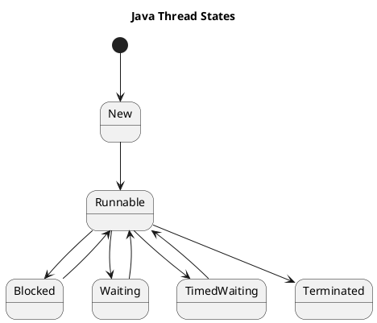

> error handling using functional programming in java

Error handling using functional programming in Java can be achieved using the `Optional` class and `Try` monad. Here are some examples of how they can be used:

1.  Using Optional class: The `Optional` class can be used to represent a value that may or may not be present. It is a functional way of handling null values in Java. Here is an example:

```
Optional<Integer> optional = Optional.ofNullable(value);
optional.ifPresentOrElse(
    // handle the present case
    val -> System.out.println("Value is present: " + val),
    // handle the absent case
    () -> System.out.println("Value is absent")
);
```

In the above example, the `ofNullable()` method creates an Optional instance that may contain a null value. The `ifPresentOrElse()` method takes two lambda expressions - the first one is executed if the value is present, and the second one is executed if the value is absent.

2.  Using Try monad: The `Try` monad is a way to handle exceptions in a functional way. It is similar to the `Optional` class, but it can also handle exceptions that occur during computation. Here is an example:

```
Try<Integer> result = Try.of(() -> Integer.parseInt(str));
result.onSuccess(
    // handle the success case
    val -> System.out.println("Parsed value: " + val)
).onFailure(
    // handle the failure case
    ex -> System.out.println("Parsing failed: " + ex.getMessage())
);
```

In the above example, the `of()` method takes a lambda expression that may throw an exception. If the lambda expression succeeds, a `Success` instance is returned, which can be handled by the `onSuccess()` method. If the lambda expression throws an exception, a `Failure` instance is returned, which can be handled by the `onFailure()` method.

These are just a few examples of how functional programming concepts can be used for error handling in Java. There are many other functional programming libraries and concepts that can be used for this purpose, such as `Either` monad, `Validation` monad, and `Try` with `Recover` method, etc.

> how does Result monad work for error handling

The `Result` monad is a functional programming concept used for error handling. It is similar to the `Try` monad, but with some differences in behavior and usage.

In essence, the `Result` monad represents a computation that can result in either a success or a failure. It is defined as a container that holds either a successful value or an error message.

Here is an example of how the `Result` monad can be used in Java:

java

```
public Result<Integer, String> divide(int numerator, int denominator) {
    if (denominator == 0) {
        return Result.failure("Division by zero");
    } else {
        return Result.success(numerator / denominator);
    }
}
```

In the above example, the `divide()` method takes two integers and returns a `Result` instance that contains either the result of the division (if the denominator is not zero), or an error message (if the denominator is zero).

Here is an example of how the `Result` monad can be used to handle the result of the `divide()` method:

```
Result<Integer, String> result = divide(10, 5);
result.match(
    // handle the success case
    val -> System.out.println("Result is: " + val),
    // handle the failure case
    err -> System.out.println("Error occurred: " + err)
);
```

In the above example, the `match()` method takes two lambda expressions - the first one is executed if the `Result` instance is a success, and the second one is executed if the `Result` instance is a failure.

The `Result` monad provides a functional way to handle errors in Java, allowing for better composition and more concise error handling code. It is widely used in functional programming languages and libraries, and is becoming more popular in Java as well.

> extend the Result class to include implementation of flatMap to apply function in case of success and error in case of error

Sure, here's an example implementation of a `Result` class with a `flatMap()` method that applies a function to the successful value and returns a new `Result` instance:

```java
import java.util.function.Function;

public class Result<T, E> {
    private final T value;
    private final E error;
    
    private Result(T value, E error) {
        this.value = value;
        this.error = error;
    }
    
    public static <T, E> Result<T, E> success(T value) {
        return new Result<>(value, null);
    }
    
    public static <T, E> Result<T, E> failure(E error) {
        return new Result<>(null, error);
    }
    
    public boolean isSuccess() {
        return value != null;
    }
    
    public boolean isFailure() {
        return error != null;
    }
    
    public T getValue() {
        return value;
    }
    
    public E getError() {
        return error;
    }
    
    public <U> Result<U, E> flatMap(Function<T, Result<U, E>> mapper) {
        if (isSuccess()) {
            return mapper.apply(value);
        } else {
            return Result.failure(error);
        }
    }
}
```

In this implementation, the `flatMap()` method takes a `Function` that maps the successful value to a new `Result` instance. If the current `Result` instance is a success, the `mapper` function is applied to the value and the resulting `Result` instance is returned. If the current `Result` instance is a failure, a new `Result` instance with the same error is returned.

Here's an example of how this `Result` class can be used with the `flatMap()` method:


```
Result<Integer, String> result1 = Result.success(10);
Result<Integer, String> result2 = Result.failure("Error occurred");

Result<Integer, String> mappedResult1 = result1.flatMap(
    val -> Result.success(val * 2)
);
System.out.println(mappedResult1.getValue()); // Output: 20

Result<Integer, String> mappedResult2 = result2.flatMap(
    val -> Result.success(val * 2)
);
System.out.println(mappedResult2.getError()); // Output: Error occurred
```

In the above example, the `flatMap()` method is used to apply a function to the successful value of `result1`, which returns a new `Result` instance with the mapped value. The `flatMap()` method is also used with `result2`, which returns a new `Result` instance with the same error.


```plantuml
@startuml Hello World

!define AWSPuml https://raw.githubusercontent.com/awslabs/aws-icons-for-plantuml/v15.0/dist
!include AWSPuml/AWSCommon.puml
!include AWSPuml/BusinessApplications/all.puml
!include AWSPuml/Storage/SimpleStorageService.puml

actor "Person" as personAlias
WorkDocs(desktopAlias, "Label", "Technology", "Optional Description")
SimpleStorageService(storageAlias, "Label", "Technology", "Optional Description")

personAlias --> desktopAlias
desktopAlias --> storageAlias

@enduml
```
> What is the difference between Kotlin and java

| Feature | Kotlin | Java |
| --- | --- | --- |
| Syntax | Concise and expressive. Eliminates boilerplate code. | More verbose and requires more code. |
| Null Safety | Has null safety built into the language. Helps prevent null pointer exceptions. | Null safety is not built into the language, but can be achieved with libraries like Optional. |
| Interoperability | Fully interoperable with Java. Can use Java libraries and frameworks seamlessly. | Interoperable with Kotlin, but requires some setup. Can use Java libraries and frameworks. |
| Functional Programming | Supports functional programming concepts like higher-order functions and lambdas. | Supports functional programming concepts, but not as extensively as Kotlin. |
| Type Inference | Supports type inference, which can reduce the amount of code required. | Supports type inference, but not as extensively as Kotlin. |
| Learning Curve | Has a relatively low learning curve, especially for developers familiar with Java. | Has a higher learning curve than Kotlin, especially for developers new to programming. |
| Android Development | Officially supported by Google for Android development. | Has been used for Android development for many years, but is now being replaced by Kotlin. |

Overall, Kotlin offers a more modern and streamlined approach to programming, with features like null safety and concise syntax

> what are the functional programming concepts in java

Java supports several functional programming concepts, although not as extensively as languages like Kotlin or Haskell. Here are some of the main functional programming concepts supported by Java:

- Lambda expressions: These are anonymous functions that can be passed around as values. Lambda expressions are a concise way to express functional interfaces, which are interfaces with a single abstract method. They are useful for functional programming paradigms like map, filter, and reduce.
- Method references: This is a shorthand syntax for writing lambda expressions that simply call an existing method. Method references allow you to pass a method as an argument to another method, making it easier to write code in a functional style.
- Streams: Streams are a sequence of elements that support functional-style operations such as map, filter, and reduce. They are a way to process collections of data in a functional way, without having to write explicit loops.
- Optional: Optional is a container object that may or may not contain a value. It provides a way to handle null values in a functional way, without having to check for null explicitly. Optional supports methods like map and filter, which allow you to transform and filter values in a functional way.
- Immutability: Java supports immutability through the final keyword, which makes variables unchangeable. Immutability is a key concept in functional programming, as it helps prevent unintended side effects.
These concepts allow Java developers to write code in a more functional style, which can make code more concise, readable, and maintainable.

> Suppose you have two threads, one thread can print only even numbers and another thread can only print odd numbers. Write a program in java to print numbers from 1 to n in sequencial order

Java program that uses two threads to print numbers from 1 to n in sequential order, with one thread printing even numbers and the other thread printing odd numbers:

```java
import java.util.Scanner;

public class PrintNumbers {
private static Object lock = new Object();
private static boolean evenTurn = true;

    public static void main(String[] args) {
        Scanner scanner = new Scanner(System.in);
        System.out.print("Enter the value of n: ");
        int n = scanner.nextInt();
        scanner.close();
        
        Thread t1 = new Thread(new EvenThread(n));
        Thread t2 = new Thread(new OddThread(n));
        t1.start();
        t2.start();
    }
    
    static class EvenThread implements Runnable {
        private int n;
        
        public EvenThread(int n) {
            this.n = n;
        }
        
        @Override
        public void run() {
            for (int i = 2; i <= n; i += 2) {
                synchronized (lock) {
                    while (!evenTurn) {
                        try {
                            lock.wait();
                        } catch (InterruptedException e) {
                            e.printStackTrace();
                        }
                    }
                    System.out.println(i);
                    evenTurn = false;
                    lock.notify();
                }
            }
        }
    }
    
    static class OddThread implements Runnable {
        private int n;
        
        public OddThread(int n) {
            this.n = n;
        }
        
        @Override
        public void run() {
            for (int i = 1; i <= n; i += 2) {
                synchronized (lock) {
                    while (evenTurn) {
                        try {
                            lock.wait();
                        } catch (InterruptedException e) {
                            e.printStackTrace();
                        }
                    }
                    System.out.println(i);
                    evenTurn = true;
                    lock.notify();
                }
            }
        }
    }
}
```

The program uses a shared lock object to synchronize the access to the shared evenTurn variable. The evenTurn variable is used to indicate which thread should print the next number. The even thread prints even numbers, while the odd thread prints odd numbers.
In each thread's run method, the program uses a while loop to check if it is its turn to print a number. If it is not its turn, the thread waits by calling lock.wait(). When it is its turn, the thread prints the number and updates the evenTurn variable to indicate the other thread's turn. Finally, the thread calls lock.notify() to wake up the waiting thread and allow it to check its turn again.
Note that the program assumes that the value of N is even. If N is odd, the even thread will print one less number than the odd thread.

> explain how java threads are managed using wait and notify

Java threads can be managed using the `wait` and `notify` methods, which are defined in the `Object` class. These methods are used to coordinate the activities of multiple threads that need to access a shared resource.

When a thread calls the `wait` method on an object, it releases the lock on that object and enters a waiting state. The thread will remain in the waiting state until another thread calls the `notify` or `notifyAll` method on the same object. At that point, the waiting thread is notified and it will attempt to re-acquire the lock on the object. If the thread successfully re-acquires the lock, it can resume execution from the point where it left off.

The `wait` and `notify` methods are typically used in a producer-consumer scenario, where one or more threads produce data that is consumed by another thread. In this scenario, the producer threads would call the `wait` method when there is no more data to produce, and the consumer thread would call the `notify` method when new data is available.

In the context of the previous example of printing even and odd numbers using two threads, the `wait` and `notify` methods are used to ensure that the threads take turns printing the even and odd numbers. The `lock` object is used to synchronize access to the shared resource (i.e., the console output), and the `evenTurn` variable is used to determine which thread is allowed to print next.

In the `EvenThread` class, the thread enters a loop where it acquires the lock, checks if it is its turn to print (by checking the value of `evenTurn`), and prints the even number if it is its turn. If it is not its turn, the thread releases the lock and enters a waiting state by calling the `wait` method. When the `OddThread` class prints an odd number, it acquires the lock, sets the value of `evenTurn` to `true`, and calls the `notify` method to wake up the waiting `EvenThread`.

Similarly, in the `OddThread` class, the thread enters a loop where it acquires the lock, checks if it is its turn to print, and prints the odd number if it is its turn. If it is not its turn, the thread releases the lock and enters a waiting state by calling the `wait` method. When the `EvenThread` class prints an even number, it acquires the lock, sets the value of `evenTurn` to `false`, and calls the `notify` method to wake up the waiting `OddThread`.

> implement producer and consumer design using java threads

Here is an example of implementing the producer-consumer design pattern using Java threads:

```java
import java.util.LinkedList;

public class ProducerConsumerExample {
    public static void main(String[] args) {
        // Create a shared buffer
        LinkedList<Integer> buffer = new LinkedList<>();

        // Create a producer thread and a consumer thread
        Thread producer = new Thread(new Producer(buffer));
        Thread consumer = new Thread(new Consumer(buffer));

        // Start the threads
        producer.start();
        consumer.start();
    }
}

class Producer implements Runnable {
    private LinkedList<Integer> buffer;
    private int maxSize = 5;

    public Producer(LinkedList<Integer> buffer) {
        this.buffer = buffer;
    }

    @Override
    public void run() {
        int i = 0;
        while (true) {
            try {
                produce(i++);
            } catch (InterruptedException e) {
                e.printStackTrace();
            }
        }
    }

    private void produce(int i) throws InterruptedException {
        synchronized (buffer) {
            while (buffer.size() == maxSize) {
                System.out.println("Buffer is full. Producer is waiting...");
                buffer.wait();
            }

            buffer.add(i);
            System.out.println("Produced: " + i);
            buffer.notifyAll();
        }
    }
}

class Consumer implements Runnable {
    private LinkedList<Integer> buffer;

    public Consumer(LinkedList<Integer> buffer) {
        this.buffer = buffer;
    }

    @Override
    public void run() {
        while (true) {
            try {
                consume();
            } catch (InterruptedException e) {
                e.printStackTrace();
            }
        }
    }

    private void consume() throws InterruptedException {
        synchronized (buffer) {
            while (buffer.isEmpty()) {
                System.out.println("Buffer is empty. Consumer is waiting...");
                buffer.wait();
            }

            int value = buffer.removeFirst();
            System.out.println("Consumed: " + value);
            buffer.notifyAll();
        }
    }
}

```

In this example, the `Producer` and `Consumer` classes implement the `Runnable` interface and are run as separate threads. The `Producer` produces items by adding integers to the shared buffer, and the `Consumer` consumes items by removing integers from the buffer.

The `produce` method of the `Producer` class uses the `wait` and `notifyAll` methods to coordinate with the `Consumer` thread. If the buffer is full, the producer waits by calling the `wait` method on the buffer object. When an item is added to the buffer, the producer calls the `notifyAll` method to wake up any waiting consumers.

The `consume` method of the `Consumer` class also uses the `wait` and `notifyAll` methods to coordinate with the `Producer` thread. If the buffer is empty, the consumer waits by calling the `wait` method on the buffer object. When an item is removed from the buffer, the consumer calls the `notifyAll` method to wake up any waiting producers.

Note that the `synchronized` block is used to ensure that only one thread can access the buffer at a time.

> explain java thread states. Use Plantuml diagram to depict various thread state transition

Java threads can be in one of several states at any given time, depending on their current execution status. The possible thread states are:

1. New: A thread is in this state when it has been created but has not yet been started using the `start()` method.
2. Runnable: A thread is in this state when it has been started and is ready to run but has not yet been selected to run by the scheduler.
3. Blocked: A thread is in this state when it is waiting for a lock on an object that is held by another thread.
4. Waiting: A thread is in this state when it is waiting indefinitely for another thread to perform a specific action.
5. Timed Waiting: A thread is in this state when it is waiting for a specific period of time for another thread to perform a specific action.
6. Terminated: A thread is in this state when it has completed its execution and has terminated.

Here is a Plantuml diagram that depicts the various thread state transitions:



This diagram shows that a new thread transitions to the runnable state when it is started using the `start()` method. The thread remains in the runnable state until it is selected by the scheduler to run. When the thread is waiting for a lock on an object that is held by another thread, it transitions to the blocked state. When the lock is released, the thread transitions back to the runnable state.

If a thread is waiting indefinitely for another thread to perform a specific action, it transitions to the waiting state. When the other thread performs the required action and notifies the waiting thread, it transitions back to the runnable state. If a thread is waiting for a specific period of time, it transitions to the timed waiting state. When the timer expires, the thread transitions back to the runnable state.

Finally, when a thread completes its execution, it transitions to the terminated state.


