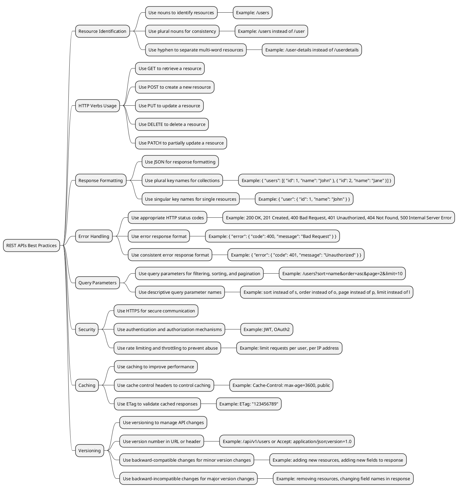

> what is the difference between public and private APIs in REST

In REST, the terms "public" and "private" API refer to the accessibility of the API to different users.

A public API is an interface that is available to anyone who has access to the internet. Anyone can use it, and it is not restricted to a particular user or application. Public APIs are typically used to enable third-party developers to build applications that interact with a service or platform.

In contrast, a private API is an interface that is available only to a specific group of users or applications. Private APIs are typically used to provide access to internal systems or data within an organization. Private APIs are usually secured with authentication and access controls to ensure that only authorized users or applications can access them.

The main difference between public and private APIs is the level of accessibility. Public APIs are available to anyone, while private APIs are limited to a specific group of users or applications. Additionally, public APIs are often designed with scalability and stability in mind, as they may be used by many different applications and services, while private APIs are often designed to meet the specific needs of a particular organization or application.

> API design single responsibility and concern

API design principles often emphasize the importance of single responsibility and concern. These principles guide developers to create APIs that are easy to use, maintain, and scale.

Single Responsibility Principle (SRP) states that a class or module should have only one reason to change. In the context of API design, it means that each endpoint or function should have a specific and clearly defined responsibility. For example, an API endpoint that handles user authentication should not also be responsible for generating a user's shopping cart.

By following the SRP, an API can be more modular and easier to understand. This can lead to faster development cycles and better maintainability, as changes to one part of the API won't affect the functionality of other parts.

Concern Separation Principle (CSP) states that different concerns should be separated into distinct modules or layers. In the context of API design, it means that different aspects of an API (e.g., authentication, authorization, data retrieval) should be implemented separately and not mixed together in a single endpoint.

By following the CSP, an API can be more scalable and easier to maintain. For example, if an API has a separate authentication layer, it can be swapped out or upgraded without affecting other parts of the API. Additionally, different teams can work on different concerns of the API without interfering with each other's work.

Overall, the single responsibility and concern separation principles are important in API design because they promote modularity, maintainability, and scalability. By keeping these principles in mind, developers can create APIs that are easy to use and evolve over time.

> Best Practices for Rest API Design

