> What is FinTech

FinTech, short for financial technology, refers to the application of innovative technology to the delivery of financial services. It is an umbrella term that encompasses a range of financial services such as mobile banking, online payment systems, investment management, insurance, peer-to-peer lending, and many more.

FinTech has disrupted traditional financial services, allowing for faster, more efficient, and more cost-effective financial transactions and services. The rise of FinTech has also led to the emergence of new business models and opportunities in the financial industry.

Overall, FinTech aims to improve the user experience of financial services by leveraging the latest technologies, such as artificial intelligence, blockchain, and big data, among others.

> What is alternate financing ?

Alternate financing, also known as alternative financing, refers to the use of non-traditional methods to obtain funding for a business or project. It involves accessing funding from sources other than traditional banks or financial institutions, such as private investors, crowdfunding platforms, peer-to-peer lending platforms, and other non-bank lenders.

The rise of alternate financing has been driven by a number of factors, including the difficulty that some businesses face in obtaining loans from traditional lenders, the emergence of new technologies that enable more efficient and cost-effective lending, and the increasing demand for innovative financing solutions.

Alternate financing can take many forms, such as equity crowdfunding, invoice financing, asset-based lending, revenue-based financing, and many others. These methods of financing are often faster and more flexible than traditional bank loans, and may be more accessible to small and medium-sized businesses.

However, alternate financing may also carry higher costs and risks, as well as greater complexity and regulatory requirements. It is important for businesses to carefully evaluate the costs and benefits of different financing options before choosing the one that is best suited to their needs.

> How does underwriting take place for business loans

Underwriting for business loans involves the evaluation of a business's creditworthiness, financial performance, and ability to repay the loan. This process is usually carried out by a lender or a team of underwriters who specialize in assessing credit risk.

The underwriting process typically involves the following steps:

Application: The business submits a loan application, which includes information about its financials, credit history, and the purpose of the loan.

Credit analysis: The underwriter will review the business's credit history, credit score, and credit utilization to determine the risk of default.

Financial analysis: The underwriter will review the business's financial statements, including its income statement, balance sheet, and cash flow statement, to assess its financial health and ability to repay the loan.

Collateral analysis: If the loan is secured by collateral, such as real estate or equipment, the underwriter will assess the value and quality of the collateral to determine its adequacy to secure the loan.

Risk assessment: Based on the analysis of the creditworthiness, financial health, and collateral value, the underwriter will determine the level of risk associated with the loan and make a decision on whether to approve or deny the loan application.

Loan structure: If the loan is approved, the underwriter will determine the loan structure, including the interest rate, repayment term, and any collateral requirements.

Overall, the underwriting process for business loans is designed to assess the risk of default and ensure that the lender is able to make informed lending decisions based on the borrower's creditworthiness and ability to repay the loan.

> How is risk handled during underwriting of business loans

During underwriting of business loans, risk is handled by carefully assessing and evaluating a range of factors related to the borrower and the loan, and making decisions based on the level of risk involved. The goal is to identify and mitigate potential risks, while still providing access to credit for businesses that are creditworthy and have the ability to repay the loan.

Some of the key factors that are considered in the underwriting process to manage risk include:

Creditworthiness: The underwriter will assess the borrower's credit history, credit score, and credit utilization to determine the risk of default. A borrower with a strong credit history is considered to be a lower risk.

Financial stability: The underwriter will review the borrower's financial statements, including its income statement, balance sheet, and cash flow statement, to assess its financial health and ability to repay the loan. A borrower with strong financials is considered to be a lower risk.

Collateral: If the loan is secured by collateral, such as real estate or equipment, the underwriter will assess the value and quality of the collateral to determine its adequacy to secure the loan. Collateral helps to mitigate risk by providing a source of repayment in the event of default.

Industry and market conditions: The underwriter will consider the borrower's industry and market conditions to assess the risk of repayment. For example, a borrower in a stable industry with strong growth prospects is considered to be a lower risk.

Loan structure: The underwriter will structure the loan based on the level of risk involved, setting the interest rate, repayment term, and any collateral requirements that are appropriate for the level of risk.

Overall, risk is managed during the underwriting process by carefully assessing a range of factors related to the borrower and the loan, and making decisions based on the level of risk involved. The goal is to provide credit to creditworthy borrowers while mitigating potential risks to the lender.

> What is Credit Fraud and Risk Platform

- A Credit Fraud and Risk Platform is a system or set of tools that financial institutions use to manage risk and prevent fraud associated with their credit products, such as loans or credit cards. 
- It typically involves a combination of data analytics, compliance management, and risk assessment tools to identify potential risks and prevent fraudulent activity. 
- The platform may also include features for loan servicing, payment processing, and collections management. 
- The goal of a Credit Fraud and Risk Platform is to ensure that financial institutions can effectively manage risk and prevent fraud, while also providing a positive customer experience for their borrowers.

> what the elements of Credit Fraud and Risk Platform in banking product

A Credit Fraud and Risk Platform in banking products typically includes several elements to help mitigate credit fraud and manage risk. Some of the key elements may include:

Fraud detection and prevention: The platform may include tools and systems to detect and prevent credit fraud, such as identity theft, application fraud, and account takeover. This may involve monitoring customer behavior, analyzing transaction data, and using machine learning algorithms to detect patterns and anomalies that indicate fraudulent activity.

Credit risk assessment: The platform may include tools and systems to assess the credit risk of customers and potential borrowers. This may involve analyzing credit history, financial statements, and other relevant data to determine the likelihood of default or other credit risks.

Compliance management: The platform may include tools and systems to manage compliance with relevant laws, regulations, and internal policies related to credit and risk management. This may involve monitoring for compliance breaches, reporting on compliance status, and ensuring that appropriate controls are in place to manage risks.

Customer due diligence: The platform may include tools and systems to perform due diligence on customers and potential borrowers. This may involve verifying identity, checking for criminal history or other red flags, and conducting background checks to ensure that the customer is creditworthy and poses minimal risk.

Risk mitigation strategies: The platform may include tools and systems to implement risk mitigation strategies, such as credit limits, collateral requirements, and other controls that can help reduce the risk of default or credit fraud.

Overall, a Credit Fraud and Risk Platform in banking products is designed to help financial institutions manage credit risk and prevent credit fraud. By leveraging advanced technologies and analytics, these platforms can provide greater visibility into credit risk and help financial institutions make more informed lending decisions, while also protecting against credit fraud and ensuring compliance with relevant laws and regulations.

> MindMap on the topic of Credit Fraud and Risk Platform for banking product

```plantuml
@startmindmap
*[#FFFF00] Credit Fraud and Risk Platform for Banking Products
++ Fraud Detection and Prevention
+++ Identity Theft
++++ Stolen Identity
****[#FFA500] Credit Bureaus : Companies that collect and maintain consumer credit information, and provide credit reports to lenders.
****[#FFA500] Biometrics : Automated methods of identifying a person based on physical or behavioral characteristics, such as fingerprints or typing patterns.
++++ Synthetic Identity
****[#FFA500] Document Verification : Process of verifying the authenticity of documents, such as driver's licenses or passports, presented by applicants.
****[#FFA500] Data Analytics : Techniques used to analyze large datasets and identify patterns or anomalies that could indicate fraud.
++++ Account Takeover
****[#FFA500] Two-Factor Authentication : Security process that requires two forms of identification to access an account, such as a password and a fingerprint.
****[#FFA500] Behavior Analysis : Analysis of user behavior to identify patterns that could indicate fraudulent activity.
+++ Application Fraud
++++ Fake Documents
****[#FFA500] Data Analytics : Techniques used to analyze large datasets and identify patterns or anomalies that could indicate fraud.
****[#FFA500] Document Verification : Process of verifying the authenticity of documents, such as driver's licenses or passports, presented by applicants.
++++ False Information
****[#FFA500] Data Analytics : Techniques used to analyze large datasets and identify patterns or anomalies that could indicate fraud.
+++ Payment Fraud
++++ Credit Card Fraud
****[#FFA500] Fraud Detection Tools : Automated tools used to detect fraudulent credit card transactions.
****[#FFA500] Data Analytics : Techniques used to analyze large datasets and identify patterns or anomalies that could indicate fraud.
++++ Check Fraud
****[#FFA500] Image Analysis : Analysis of check images to identify signs of tampering or alteration.
****[#FFA500] Data Analytics : Techniques used to analyze large datasets and identify patterns or anomalies that could indicate fraud.
++++ Wire Fraud
****[#FFA500] Payment Monitoring Tools : Tools used to monitor wire transfer activity for signs of fraudulent activity.
****[#FFA500] Data Analytics : Techniques used to analyze large datasets and identify patterns or anomalies that could indicate fraud.
++ Credit Risk Assessment
+++ Credit History
++++ Payment History
****[#FFA500] Credit Report Analysis : Analysis of credit reports to determine the borrower's creditworthiness and risk of default.
****[#FFA500] Risk Scoring Models : Models used to calculate the borrower's risk of default based on their credit report and other factors.
++++ Default History
****[#FFA500] Risk Scoring Models : Models used to calculate the borrower's risk of default based on their credit report and other factors.
+++ Financial Statements
++++ Income Statement
****[#FFA500] Cash Flow Analysis : Analysis of a company's cash flow to determine their ability to meet their financial obligations.
****[#FFA500] Ratio Analysis : Analysis of a company's financial ratios to determine their financial health and risk of default.
++++ Balance Sheet
****[#FFA500] Ratio Analysis : Analysis of a company's financial ratios to determine their financial health and risk of default.
++++ Cash Flow Statement
****[#FFA500] Trend Analysis : Analysis of a company's cash flow trends to determine their ability to meet their financial obligations.
+++ Other Relevant Data
++++ Public Records
****[#FFA500] Background Checks : Process of verifying the background and legal history of a borrower or company.
****[#FFA500] Risk Assessment : Assessment of a borrower or company's risk based on their background and legal history.
++++ Reputation Score
****[#FFA500] Online Reputation Analysis : Analysis of a borrower or company's online reputation and reviews to determine their level of trustworthiness and credibility.
++ Compliance Management
+++ KYC/AML
++++ Customer Due Diligence
****[#FFA500] Identity Verification : Process of verifying the identity of a customer or client using various methods such as biometrics, document verification or knowledge-based authentication.
****[#FFA500] Risk Assessment : Assessment of a customer or client's risk level based on their identity and transaction history.
++++ Transaction Monitoring
****[#FFA500] Automated Tools : Tools used to monitor transactions in real-time and identify suspicious activity.
****[#FFA500] Risk Assessment : Assessment of a transaction's risk level based on various factors such as the amount, frequency, and destination.
+++ Regulatory Compliance
++++ Compliance Auditing
****[#FFA500] Internal Controls : Measures put in place by a financial institution to ensure compliance with regulations and policies.
****[#FFA500] Audit Trail : A record of all activities related to compliance, such as transaction logs, audit reports, and compliance certificates.
++++ Compliance Reporting
****[#FFA500] Regulatory Reporting : Reporting of compliance-related data to regulatory bodies to ensure compliance with laws and regulations.
****[#FFA500] Data Analytics : Techniques used to analyze compliance-related data and identify areas for improvement or potential risks.
****[#FFA500] Risk Assessment : Assessment of compliance-related risks and development of risk mitigation strategies.
++ Portfolio Management
+++ Risk-Based Pricing
++++ Loan Structuring
****[#FFA500] Credit Scoring : Evaluation of a borrower's creditworthiness and risk of default based on various factors such as credit history and financial statements.
****[#FFA500] Risk-Based Pricing Models : Models used to price loans based on the borrower's risk level and creditworthiness.
++++ Collateral Evaluation
****[#FFA500] Valuation : Evaluation of the value of a borrower's collateral to determine the loan-to-value ratio and the level of risk associated with the loan.
****[#FFA500] Risk Assessment : Assessment of the risk associated with the collateral and the borrower's ability to repay the loan.
+++ Loan Servicing
++++ Payment Processing
****[#FFA500] Payment Processing Tools : Tools used to process loan payments and manage loan accounts.
****[#FFA500] Data Analytics : Techniques used to analyze loan payment data and identify potential risks or areas for improvement.
++++ Collections Management
****[#FFA500] Collections Tools : Tools used to manage collections processes and mitigate risks associated with delinquent loans.
****[#FFA500] Risk Assessment : Assessment of the risk associated with delinquent loans and development of strategies to mitigate that risk.
****[#FFA500] Data Analytics : Techniques used to analyze collections-related data and identify potential risks or areas for improvement.
@endmindmap
```

