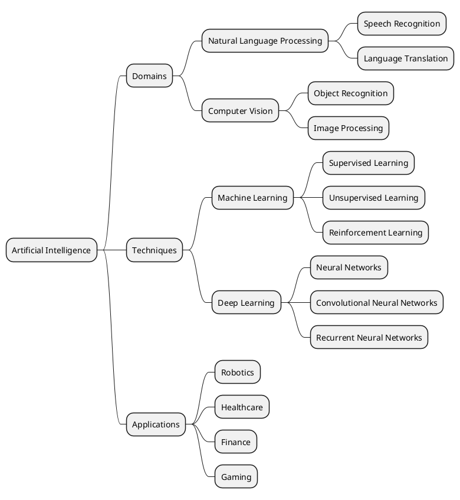
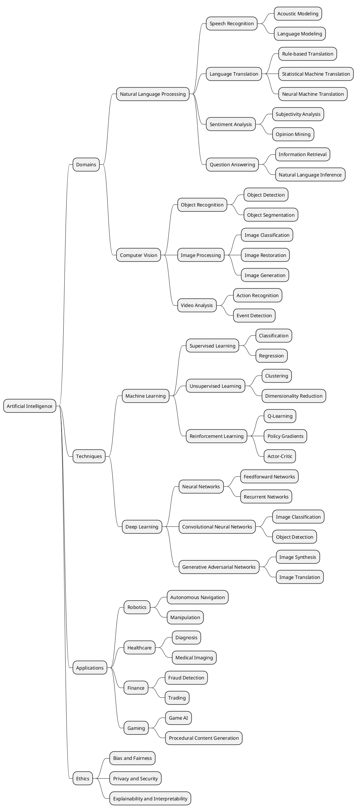
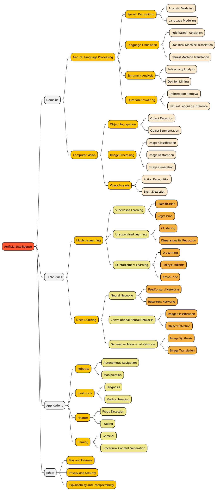

**[Mindmaps using ChatGPT and PlantUML](https://aruva.medium.com/mindmaps-using-chatgpt-and-plantuml-fb38c1d84a19)**

> What's a mindmap

---

A mind map is a diagram or visual tool used to represent ideas, words, tasks, or other items linked to and arranged around a central idea or concept. It is often used as a brainstorming or organizational tool to capture and visualize ideas, concepts, and information.

In a mind map, the central idea is typically placed in the center of the page or canvas, and related ideas or topics branch out from it, forming a tree-like structure. These branches can be further divided into sub-branches, which can contain more detailed information, keywords, or images. The branches and sub-branches are connected by lines or arrows, representing the relationships between the ideas.

The purpose of a mind map is to stimulate creative thinking, organize information, and facilitate the process of problem-solving, decision-making, note-taking, and learning. Mind maps are used in many different fields, including education, business, psychology, and personal development.

---

> Okay, Let's start by creating a simple MindMap on the topic of Artificial Intelligence. Can you give the mindmap in PlantUML format. Keep it structured from the core central topic branching out to other domains and sub-domains. Let's go to 4 levels to begin with. Add the start and end mindmap tags and keep it expanding on one side for now

---

Sure! Here's a simple mind map on the topic of Artificial Intelligence in PlantUML format:

markdown

In this mind map, the central topic is "Artificial Intelligence". The first level branches out to three domains of AI, namely "Natural Language Processing" and "Computer Vision". The second level branches out further to sub-domains, such as "Speech Recognition" and "Language Translation" under "Natural Language Processing", and "Object Recognition" and "Image Processing" under "Computer Vision".

The third level branches out to different AI techniques used in these domains, such as "Machine Learning", which has sub-branches of "Supervised Learning", "Unsupervised Learning", and "Reinforcement Learning". Another technique is "Deep Learning", which has sub-branches of "Neural Networks", "Convolutional Neural Networks", and "Recurrent Neural Networks".

The fourth level of the mind map lists some of the applications of AI, such as "Robotics", "Healthcare", "Finance", and "Gaming".

---

> Can you increase it by two more levels and add further domains

---

Sure! Here's an expanded version of the mind map on Artificial Intelligence with two more levels:

markdown

In this expanded version, the third level branches out to more specific techniques used in the domains of AI. For example, "Natural Language Processing" has sub-branches of "Speech Recognition", "Language Translation", "Sentiment Analysis", and "Question Answering". "Computer Vision" has sub-branches of "Object Recognition" and "Image Processing", which further branch out to more specific topics such as "Object Detection" and "Image Restoration".

The fourth level branches out to even more specific topics within the techniques of AI. For instance, "Machine Learning" has sub-branches of "Supervised Learning", "Unsupervised Learning", and "Reinforcement Learning", each with sub-branches of their own, such as "Classification" and "Regression" under "Supervised Learning".

The fifth level branches out to different applications of AI, such as "Robotics", "Healthcare", "Finance", and "Gaming", with sub-branches of specific tasks that AI can perform within those applications.

Finally, the sixth level includes an "Ethics" branch with sub-branches of "Bias and Fairness", "Privacy and Security", and "Explainability and Interpretability". These topics address important ethical considerations when developing and deploying AI systems.

---

> 2 / 2
> 
> Can you add colour codes to the above mind map? Use the format \*\[#FFFF00\] Artificial Intelligence. The above is just an example; use your colour codes for each node based on the complexity of each node in terms of the time it takes to learn that topic for a beginner

---

Sure! Here's the same mind map as before, but with color codes added based on the complexity of each node in terms of the time it takes to learn that topic for a beginner:

markdown

In this version, the color codes are based on a scale of increasing complexity, with darker shades of yellow indicating more complex topics that may take longer to learn. The central topic of "Artificial Intelligence" is given a bright orange color code to draw attention to it. The different domains

---