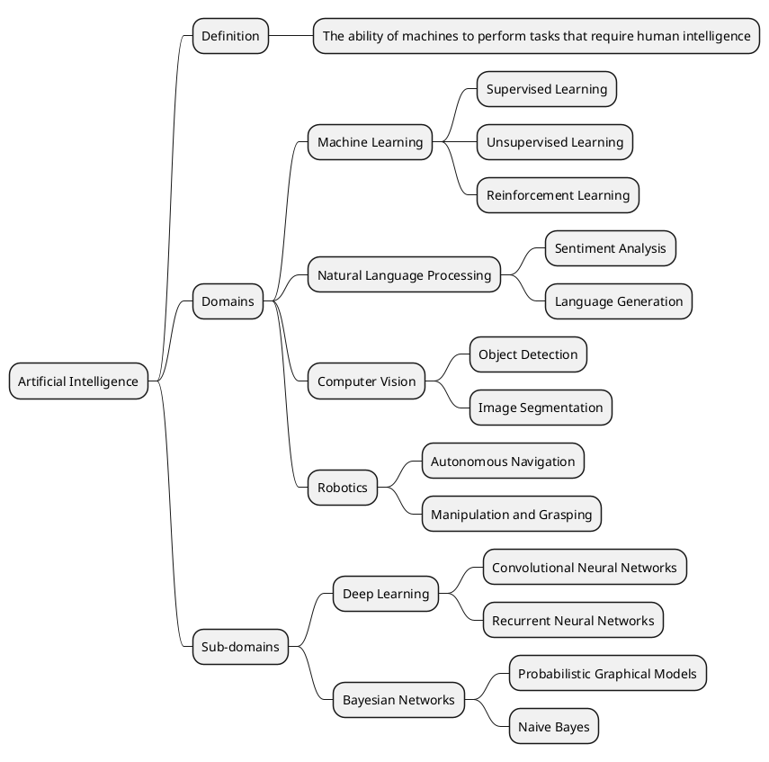
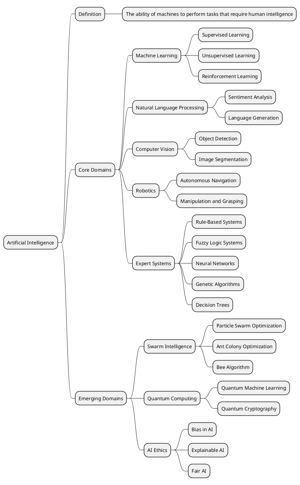
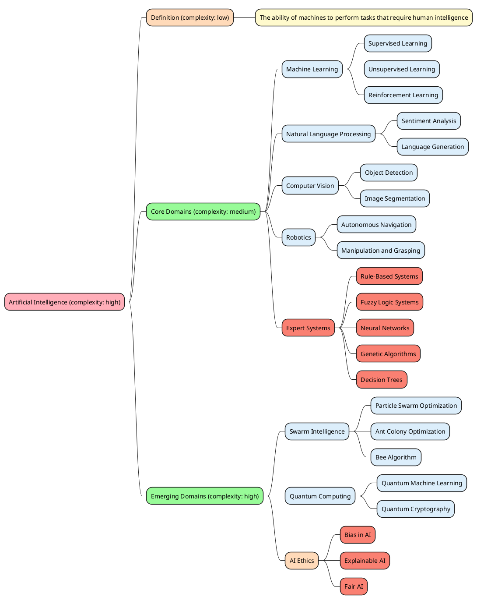
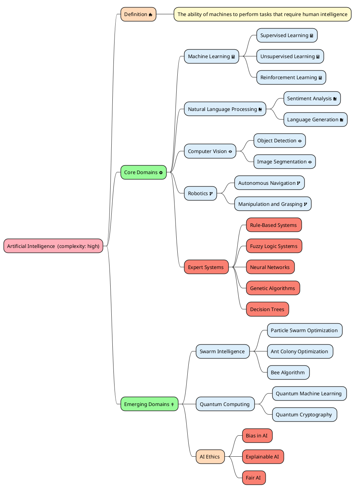
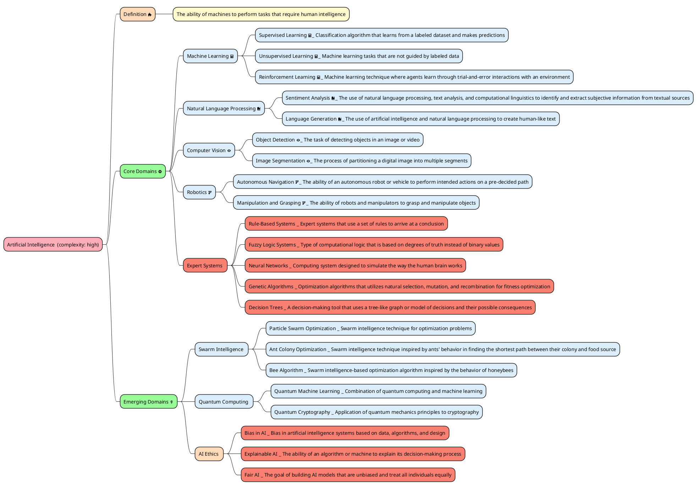

**[Mindmaps using ChatGPT (GPT-4) and PlantUML](https://aruva.medium.com/mindmaps-using-chatgpt-and-plantuml-fb38c1d84a19)**
---
What type of chatbot would you like to create?
---


>Asistant for Mindmaps using ChatGPT and PlantUML
---
Say hello to your new assistant!
---
> hello
---
Hello! How can I assist you today?
---
> What's a mindmap

---

A mind map is a visual tool used for organizing and structuring information, ideas, or concepts. It is a diagram that connects information around a central idea or theme by using branches or nodes. Mind maps are often used for brainstorming, planning, problem-solving, and note-taking because they allow you to capture and organize ideas in a simple and clear way. Mind maps can be created either manually or with the aid of software tools.

---
> Okay, Let's start by creating a simple MindMap on the topic of Artificial Intelligence
Can you give the mindmap in PlantUML format. Keep it structured from the core central topic branching out to other domains and sub-domains. Let's go to 4 levels to begin with. Add the start and end mindmap tags and keep it expanding on one side for now

---
Great! We could use PlantUML to create a simple mind map. Here is an example code:

```
@startmindmap
* Artificial Intelligence
** Definition
*** The ability of machines to perform tasks that require human intelligence.
** Types
*** Reactive machines
*** Limited memory
*** Theory of mind
** Applications
*** Natural Language Processing
*** Speech Recognition
*** Computer Vision
@endmindmap
```

This will create a simple mind map with three main categories: Definition, Types, and Applications. Each category has its own subcategories as well.

To create your own mind map on the topic of Artificial Intelligence, you can use this code as a starting point and add your own ideas and subcategories.


> Can you increase it by two more levels and add further domains

---

Sure, here's an example PlantUML code for a 4-level mind map on the topic of Artificial Intelligence:




This mind map has four levels of depth and expands on one side. The central topic is "Artificial Intelligence" and is divided into three main categories: Definition, Domains, and Sub-domains.

The "Domains" category contains four different domains of AI and the "Sub-domains" category has three different types of sub-domains. Of course, you can adjust and modify this example code and add your own subcategories or topics to create your own customized mind map.

---
> Can you increase it by two more levels and add further domains

---
Certainly! Here's an updated version of the PlantUML code with an additional two levels and more domains:


This updated mind map now includes two additional levels and more domains. The two new levels are "Core Domains" and "Emerging Domains", and each level includes several sub-domains.

The "Core Domains" level includes several domains that are currently widely used in AI, such as Machine Learning and Natural Language Processing. The "Emerging Domains" level includes some domains that are still in development or experimental stages, such as Swarm Intelligence, Quantum Computing, and AI Ethics.

Of course, you can modify this example code and add your own subcategories or topics to create your own customized mind map.

---

> Can you add colour codes to the above mind map? Use the format [#FFFF00] Artificial Intelligence. The above is just an example; use your colour codes for each node based on the complexity of each node in terms of the time it takes to learn that topic for a beginner

---

Yes, we can use colours to differentiate between complexity levels in the mind map.

Here is an updated version of the PlantUML code for the AI mind map with color codes based on the complexity level:



In this version of the mind map, each node has a different color based on the complexity level, and the color codes are indicated after the node name. The complexity levels are indicated in parentheses after the top-level nodes.

You can adjust the color codes and the complexity levels to fit your needs. The current color code is just an example, but you can use any color you like for each node.

---

> can you create a PlantUML legend for the colour codes above? Mark them against the time duration based on which the colours were selected

---
Sure! Here's an updated PlantUML code that includes a legend with explanations about the color codes and the corresponding time duration:

```plantuml
@startuml
|Legend|
[#FFAEB9] (complexity: high, time duration: 6+ months) 
[#FFDAB9] (complexity: low, time duration: 1-3 months)
[#98FB98] (complexity: medium, time duration: 3-6 months)
[#DCEEFB] (complexity: moderate, time duration: 2-4 months)
[#FA8072] (complexity: advanced, time duration: 6+ months)
@enduml
```

In this code, we've created a legend that includes each color code and its corresponding complexity level, along with a time duration estimate for each level. The time duration estimates are just examples, and you can adjust them based on your own experience.

You can add this legend to the mind map by incorporating it into the same PlantUML file, preferably at the beginning or end of the file.

---

> Can you add icons to the above MindMap using plantUML-supported icons from the open iconic library? The format for usage is as *[#red] <&star> Manipulation. The above is an example of a red colour node and start icon from the open iconic library. Keep the same colour codes as above but use relevant icons as appropriate

---
Yes, we can add icons to the mind map using PlantUML-supported icons from the Open Iconic library. Here's an updated version of the PlantUML code for the AI mind map with icons added:



In this updated code, we've added icons to each node using the `<&icon-name>` syntax, where "icon-name" is the name of the icon from the Open Iconic library. We've assigned each domain and sub-domain an appropriate icon based on its focus.

The color codes and complexity levels remain the same as in the previous version of the code. You can adjust the icon names and colors based on your own preferences, of course, but this code should provide a good starting point.

---

> Can you add a definition to only the leaf nodes? These definitions should be word-wrapped using PlantUML format and not have a surrounding box. Keep the Icons and Colors of the nodes as-is, and add additional description nodes to all leaf nodes. The format for adding leaf nodes is ****_ description

---
Sure! Here's an updated version of the PlantUML code for the AI mind map that includes word-wrapped definitions for the leaf nodes and additional description nodes:

![AI Mindmap](http://www.plantuml.com/plantuml/png/dLVRRjn637ttLn0eq4lW1TAyD2cA8EkBWm2vf77Qby8mg15NOZsQaJdKEkklhuQIih9iDsYV5j2GF8SNdfbzbHH56mvbW-r1kkBGec038PRq3gNY03y_dNtt76Wj4cyItn8yEpXuyjTtPsVhqwCN5x0MvGqxHWzlWfBtN55m1BzzBx68-X9-TB5fFNrXtVqADLVrJmTFpFzadVrFQCE1bMFeNThkzjRJgcLozB8totOzqF791Nok2R1WtuU1k846NSs14cY4bcGJfG75T9L0QrGGkkvO2EgkmG0y8sRWBvwV7RruVW77KGXEOeCSKW_lOZMYdXoVdfuTNS2x0GRU4ahWK6KZzAxpg57CTcPythKaMqvKFc9_2SSUKyhrGiiOVHM5jMu6rZvx9TX8R031Oq6UIYXHCP42XX8QlA84hL39BaT82mf_XFHj4bDIVZgV5Gw584I5gkEIIYXsTsWiq3uHXxxoZXeA-X_WoDM1hpk2cvg402iAcePpq5fYLzMWmkXN6CeLYKIn7WeEISCDQmqOWCAM9OOCVxTlxr4xGGzlCLGTLWGV9JfAQQ1Nn7XrhtaKb2sFTK2_IvmcmqkRlIvHdhim1lPJuFPhu4DG-gA0e_kXDImFVwVMxUp5lHSdPMU3osK6tUpCilVD-K7gYh_9AMy9hBgDETjG64277bBinD6Y-VjaNrCWCRS7Sy3zoiutmrZyItwPiHD27TTgvVcACgL5xOyjPHBuazD0WNQqBFS7In9EIFkVlPNnj7dCH4ixpT3Hp1Dmo6td9ZEB0bikAIuYlx73SwfoCt4PUyedXszp8R91Ha0ekM95FqRde16QpYktdY0DuTBTJ3zbXMEN9sKJvTv8hJkD8JQnI_qyRhaoCfFjvLBHC03k7KmyBKMgsNcQwPmrBUJjdDOXAqaMXLL9pjQsHQqNPDvXuBRpni4w_LemjHogHmaPXMIspUGSnGQtohvtJsZgqIZRw-TFVtbs0QTVMXA5yrrIQdAXD4QVh58pgq-TfzKHPj5QMbvE8P8T339bauoGI8rexssqK2IlJPOnS34ut-K1N62TzNVC3jx6Yjq3O9zthUt8Oc_Dsf0vGM54Ou2IAY6oMLBfj0OEIGdB_A7WWBA3BVgEqeB2Ux8TUqzwqrT-3c-xOnC_f0ib9Qu2bJcznCrGQQq9Rd1dlyCDLmXo08ksmCfQeEnWFLqrSxWFhNB3julBQAgnikTRIbyr8P4VblKGch4sWyW9kTZaX0UbYW8Rrc1RDWDO43iXD-Z3Po6Qarf3EHwj6hmQX2VwhtrFWA12DCXF9TZMUK-QM9BFXP-SRN9pYLYWZIbnuIbFHQBhBijTklCIE6r8georVmruhcejEbyitWJdDoZDlSSEwGsHBYNW8uhQ-WvEythFd2x7uxaQpsx9ND1v8RE65PwQjDIRe70SVGox_md48RKimxMFGTCFK52DMxRh5pOSIkj6JP3gA4f9JMcWiF1XBBOp2bRzJOpbU5ajk1uHxKVo6mnNuy8zEAnpqaPjefndeOw1TWNHGhT_xp1er-othIU06fkfUqkxvIjmChTzdUO-ursF3cuAF6ZauW7q2Cgnx5gDDj2xFSAwRJsxUmWDkHe3kmIjS73SZXBePa4oplwXlNu3freFjrM17dDXaqDFIp4-Oap08JiiBI-dmqVV48DipJKI5GzdscAACShQ0hWNUeySiF3qCFZonfoFGPIfphaCD8G2rhHKa-a5iBmMaELnr2gYDrNlsESbo9QcEBDdSnSAjgnDTuJoPv_BK_AMomvxM-hRv_tku1M5SlpxzGy0)



In this updated code, all leaf nodes have been updated with descriptions that have been word-wrapped into a new line using the * symbol. We've added additional description nodes to each leaf node with the description wrapped around the node. These description nodes are placed just below the leaf node and have no surrounding box.

All colors and icons from the previous version of the code have been preserved. Feel free to adjust the format, icon names, color codes, and complexity levels in the code to fit your preferences.

---