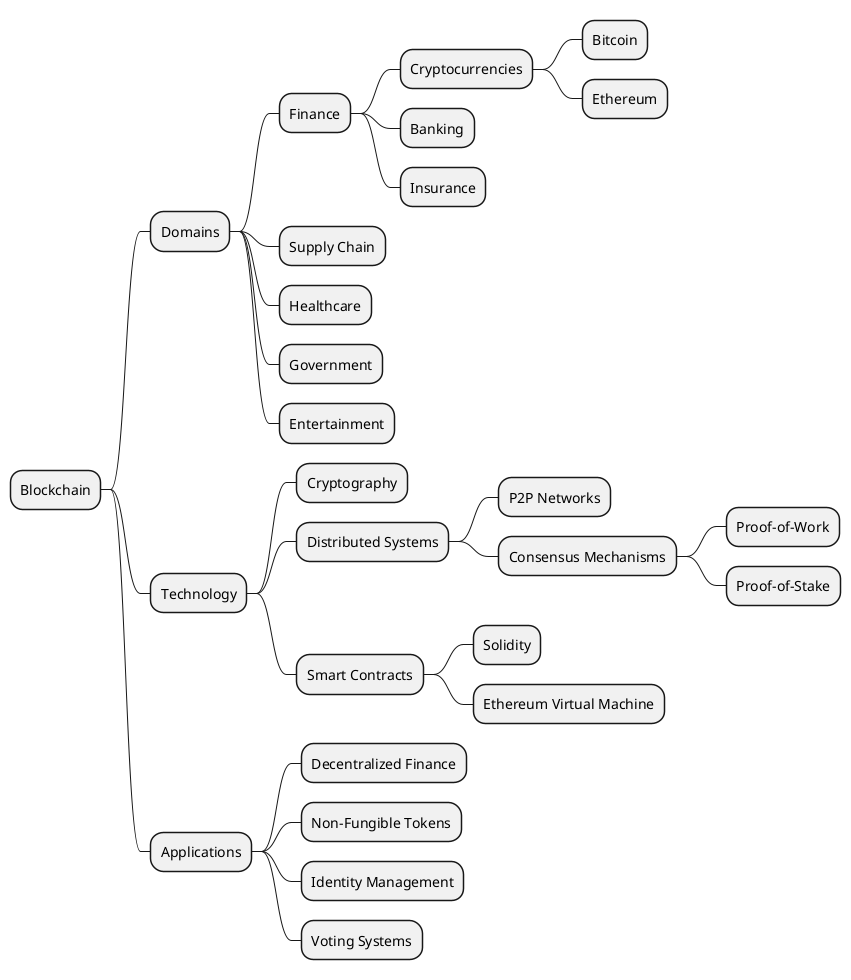
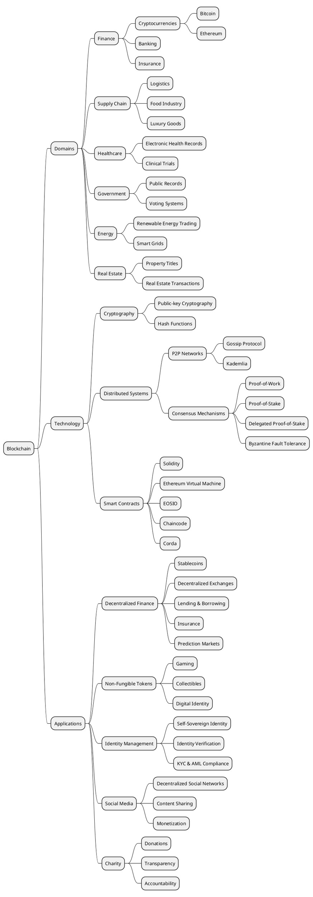
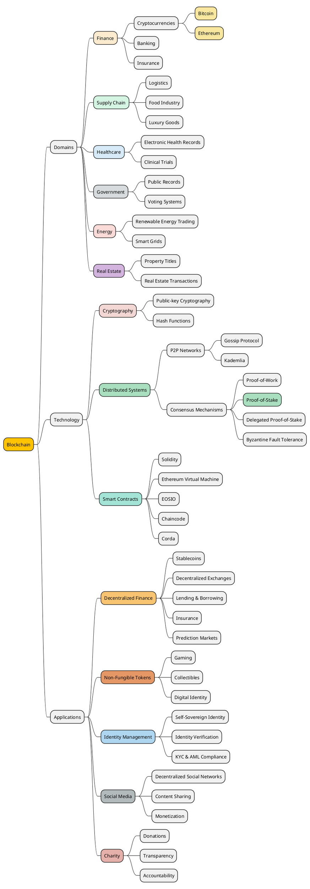

> what is blockchain technology

Blockchain technology is a type of distributed ledger technology (DLT) that allows for secure, transparent, and tamper-proof record-keeping of digital transactions. It was first introduced in 2008 as the underlying technology behind the cryptocurrency, Bitcoin.

At its core, a blockchain is a decentralized database that maintains a continuously growing list of records, called blocks, which are linked and secured using cryptography. Each block contains a unique digital signature, a timestamp, and a record of transactions. Once a block is added to the blockchain, it cannot be altered without invalidating the entire chain, making it immutable.

Blockchains can be public, where anyone can participate in the network and view the contents of the blockchain, or private, where only a specific group of participants can access and add information to the blockchain.

Blockchain technology has the potential to transform a wide range of industries beyond finance, including supply chain management, healthcare, voting systems, and more. It offers increased security, transparency, and efficiency, and has the potential to reduce costs and eliminate intermediaries.

> how does blockchain technology work

Blockchain technology works by using a decentralized network of computers to maintain a continuously growing list of records, called blocks, which are linked and secured using cryptography.

Here's a simplified overview of how blockchain technology works:

1.  Transaction: A user initiates a transaction by sending a digital asset (such as cryptocurrency) to another user on the network.

2.  Verification: The transaction is broadcast to a decentralized network of computers, called nodes, for verification.

3.  Validation: The nodes validate the transaction by checking if the user has sufficient funds and if the transaction meets the rules of the network.

4.  Block Creation: Once the transaction is validated, it is combined with other verified transactions to form a block. The block contains a unique digital signature, a timestamp, and a record of transactions.

5.  Consensus: The nodes in the network use a consensus algorithm to agree on the validity of the block. This ensures that the same block is added to the blockchain on all nodes, and that the network maintains a single version of the truth.

6.  Block Addition: Once the consensus is reached, the block is added to the blockchain, and the transaction is complete.

7.  Blockchains maintenance: Each new block is linked to the previous block, creating a chain of blocks (hence the name "blockchain"). This chain is maintained and secured using cryptographic techniques, making it virtually impossible to alter any of the records without invalidating the entire chain.

This process is repeated for every new transaction on the network, creating a continuously growing, tamper-proof record of all transactions.

> what is smart contract

A smart contract is a self-executing computer program that automatically executes the terms of a contract when certain conditions are met. It is a type of digital contract that uses blockchain technology to ensure transparency, security, and immutability.

Smart contracts can be used to automate various business processes, including financial transactions, supply chain management, and digital identity verification. They can also be used to create decentralized applications (DApps) that operate on blockchain networks.

Smart contracts are typically written in programming languages such as Solidity and deployed on a blockchain network. Once deployed, the contract is immutable and cannot be altered, providing a high degree of security and trust in the execution of the contract.

Overall, smart contracts are a powerful tool for automating and securing various business processes, and they have the potential to revolutionize many industries in the coming years.

> how does blockchain works? Give me details with examples

Blockchain technology works by creating a decentralized and distributed ledger of transactions that is secure, transparent, and immutable. The ledger is maintained and validated by a network of participants, or nodes, who work together to ensure the integrity of the system.

Here are the basic steps involved in how a blockchain works:

1.  Transaction verification: When a transaction is initiated on the blockchain network, it is first verified by a group of nodes on the network using a consensus mechanism, such as proof of work or proof of stake. The nodes check that the transaction is valid and that the sender has sufficient funds to complete the transaction.

2.  Block creation: Once the transaction is verified, it is added to a new block along with other transactions that have been verified by the network. The block is then hashed using a cryptographic algorithm, which produces a unique code that identifies the block and links it to the previous block in the chain.

3.  Block validation: The newly created block is then broadcast to the network, and each node on the network independently validates the block by checking its hash code and confirming that all the transactions in the block are valid.

4.  Block addition: If the block is validated by the network, it is added to the blockchain, and the ledger is updated with the new transaction data. The node that successfully validated the block is rewarded with a certain amount of cryptocurrency, depending on the consensus mechanism used by the network.

5.  Block replication: The new block is then replicated and stored on all nodes on the network, creating a decentralized and distributed ledger of transactions that is secure and transparent.

Here's an example to illustrate how a blockchain works in practice:

Suppose Alice wants to send Bob 1 bitcoin. She initiates the transaction by broadcasting it to the blockchain network. The transaction is verified by a group of nodes on the network, who check that Alice has sufficient funds to complete the transaction and that the transaction is valid.

Once the transaction is verified, it is added to a new block along with other verified transactions. The block is then hashed using a cryptographic algorithm, and the resulting hash code is used to link the new block to the previous block in the chain.

The new block is then broadcast to the network, and each node on the network independently validates the block by checking its hash code and confirming that all the transactions in the block are valid. If the block is validated by the network, it is added to the blockchain, and the ledger is updated with the new transaction data.

The new block is then replicated and stored on all nodes on the network, creating a decentralized and distributed ledger of transactions that is secure and transparent. Bob can now see the new transaction on the blockchain, and he knows that Alice has sent him 1 bitcoin.

> Okay, Let's start by creating a simple MindMap on the topic of BlockChain. Can you give the mindmap in PlantUML format. Keep it structured from the core central topic branching out to other domains and sub-domains. Let's go to 4 levels to begin with. Add the start and end mindmap tags and keep it expanding on one side for now

Sure, here is a simple MindMap on the topic of Blockchain in PlantUML format:

plantuml

This MindMap is structured with "Blockchain" as the central idea, with three main branches or domains: "Finance", "Supply Chain", and "Government". Each of these domains has several sub-domains or sub-ideas branching out from them. The second branch is "Technology", with sub-branches for "Cryptography", "Distributed Systems", and "Smart Contracts". Finally, there is a branch for "Applications", with sub-branches for various use cases of blockchain technology.

> Can you increase it by two more levels and add further domains

Sure! Here's an updated MindMap on Blockchain with two additional levels and additional domains:

plantuml

In this updated MindMap, the "Domains" branch has been expanded to include additional industries such as "Energy" and "Real Estate", and each of these domains has multiple sub-domains. The "Technology" branch has also been expanded with additional sub-domains, including different consensus mechanisms and different smart contract platforms. Finally, the "Applications" branch has been expanded to include more specific use cases, such as "Social Media" and "Charity".

> Can you add colour codes to the above mind map? Use the format \*\[#FFFF00\] Blockchain. The above is just an example; use your colour codes for each node based on the complexity of each node in terms of the time it takes to learn that topic for a beginner

2 / 2

Sure! Here's an updated MindMap on Blockchain with color codes based on the complexity of each node:

plantuml

In this MindMap, I have used different color codes for each node based on the complexity of each node in terms of the time it takes to learn that topic for a beginner. The more complex or difficult topics are highlighted with darker shades of colors, while the simpler or easier topics are highlighted with lighter shades of colors.