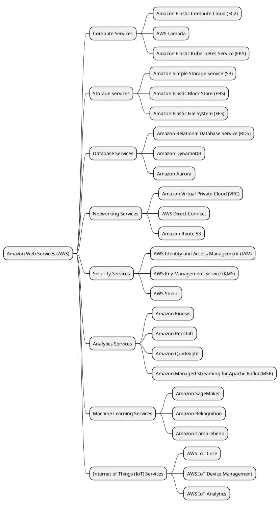

> operating distributed systems at hyper scale using cloud native best practices.

Operating distributed systems at hyper scale using cloud native best practices involves using a set of techniques and principles designed to help you build, deploy, and manage cloud-based applications at scale. Here are some key practices to consider:

1.  Use microservices architecture: Break down your application into smaller, independently deployable services, each with a well-defined interface. This allows for more efficient development and easier scalability.
    
2.  Use containerization: Deploy each service in a container to ensure consistent deployment across different environments and to make it easier to manage dependencies and versioning.
    
3.  Use orchestration: Use a container orchestration platform like Kubernetes to automate the deployment, scaling, and management of your containers.
    
4.  Implement continuous delivery: Use automation to streamline the process of building, testing, and deploying your application code, ensuring that updates are delivered quickly and reliably.
    
5.  Implement observability: Use monitoring, logging, and tracing tools to gain insights into the performance and behavior of your distributed system, allowing you to identify and resolve issues quickly.
    
6.  Implement security best practices: Use encryption, access controls, and other security measures to protect your data and applications from unauthorized access.
    

Overall, using cloud native best practices can help you build and manage distributed systems that are scalable, reliable, and efficient, while also reducing operational costs and increasing agility.

> what are cloud native best practices.

Cloud native best practices are a set of principles and techniques designed to help you build, deploy, and manage applications in the cloud more effectively. Here are some key best practices to consider:

1.  Use a microservices architecture: Break down your application into smaller, independently deployable services, each with a well-defined interface. This approach enables you to build, test, and deploy each service independently and increases the scalability of your application.
    
2.  Use containerization: Deploy each service in a container to ensure consistent deployment across different environments and to make it easier to manage dependencies and versioning.
    
3.  Use orchestration: Use a container orchestration platform like Kubernetes to automate the deployment, scaling, and management of your containers. This approach makes it easier to manage a large number of containers and ensures that your application is highly available and scalable.
    
4.  Implement continuous delivery: Use automation to streamline the process of building, testing, and deploying your application code, ensuring that updates are delivered quickly and reliably.
    
5.  Implement observability: Use monitoring, logging, and tracing tools to gain insights into the performance and behavior of your application, allowing you to identify and resolve issues quickly.
    
6.  Implement security best practices: Use encryption, access controls, and other security measures to protect your data and applications from unauthorized access.
    
7.  Use infrastructure as code: Use code to define and manage your infrastructure, making it easier to provision, manage, and scale your resources.
    

Overall, following cloud native best practices can help you build and manage applications that are scalable, reliable, and efficient, while also reducing operational costs and increasing agility.

> Explain Use infrastructure as code in detail

Infrastructure as Code (IaC) is a software engineering practice that involves managing and provisioning infrastructure resources, such as servers, networks, and storage, using code. It allows developers and operations teams to automate the creation, deployment, and management of infrastructure resources, which increases efficiency, consistency, and reduces errors.

In IaC, infrastructure resources are defined using a high-level programming language or configuration language, such as YAML, JSON, or HCL. The code is versioned and stored in a source code repository, such as Git, alongside the application code. The code describes the desired state of the infrastructure resources, and when executed, it automatically provisions and configures the resources to match the desired state.

Some of the benefits of using IaC include:

1.  Consistency: IaC ensures that the infrastructure is consistent across different environments, reducing errors and improving reliability.
    
2.  Efficiency: IaC automates the provisioning and management of infrastructure resources, reducing manual effort and increasing speed.
    
3.  Scalability: IaC enables teams to easily provision and scale infrastructure resources, making it easier to support growing applications.
    
4.  Collaboration: IaC code can be versioned and stored in a source code repository, making it easier for teams to collaborate and manage changes.
    
5.  Cost savings: IaC reduces the need for manual intervention and reduces errors, which can lead to cost savings over time.
    

Overall, IaC is an important practice for modern software development and operations. By treating infrastructure as code, teams can create a more efficient, scalable, and reliable infrastructure that can support the needs of today's applications.

> what are security best practices for cloud native

Security is a critical aspect of cloud native applications. Here are some security best practices to consider:

1.  Use the principle of least privilege: Grant users and applications only the minimum permissions necessary to do their job. This reduces the risk of a security breach.
    
2.  Implement strong access controls: Use role-based access controls (RBAC) to ensure that only authorized users can access sensitive data or resources.
    
3.  Use encryption: Encrypt data in transit and at rest using industry-standard encryption algorithms, such as SSL/TLS and AES.
    
4.  Implement network security best practices: Use firewalls, network segmentation, and other techniques to protect your network and applications from unauthorized access.
    
5.  Implement secure coding practices: Use secure coding practices to reduce the risk of vulnerabilities in your application code, such as input validation and output encoding.
    
6.  Use container security best practices: Use container security tools, such as image scanning, to ensure that only trusted images are used in your environment.
    
7.  Monitor and log events: Use monitoring and logging tools to track and analyze events in your environment, allowing you to detect and respond to security threats more quickly.
    
8.  Conduct regular security audits and testing: Regularly audit your environment and perform penetration testing to identify potential vulnerabilities and security risks.
    
9.  Follow compliance and regulatory requirements: Ensure that your environment adheres to relevant compliance and regulatory requirements, such as GDPR or HIPAA.
    

Overall, implementing these security best practices can help you build and manage secure cloud native applications that protect your data and resources from unauthorized access and reduce the risk of a security breach.

> Explain role-based access controls

Role-based access control (RBAC) is a security mechanism used to restrict access to resources based on the roles and responsibilities of users within an organization. It is a method of access control that defines permissions based on the role of a user, rather than their identity. In RBAC, users are assigned roles based on their job function, and access to resources is granted based on the roles assigned to them.

In an RBAC system, access control policies are defined based on roles rather than individual users. Each role is assigned a set of permissions that define what actions a user can perform. These permissions are then associated with specific resources, such as applications, files, or databases.

RBAC has several advantages, including:

1.  Simplifies access management: RBAC simplifies access management by enabling administrators to grant or revoke access to resources based on roles, rather than individual users.
    
2.  Reduces the risk of errors: By reducing the need for manual assignment of permissions, RBAC reduces the risk of errors and improves security.
    
3.  Enables scalability: RBAC is scalable because it is based on roles, not individual users. This means that access control policies can be easily scaled as organizations grow and change.
    
4.  Supports compliance: RBAC supports compliance with regulations and standards by providing a structured approach to access control.
    

Overall, RBAC is a powerful access control mechanism that helps organizations manage access to resources based on roles and responsibilities. By simplifying access management, reducing errors, and enabling scalability, RBAC can help organizations improve security and compliance.

> What are network security best practices

Here are some network security best practices to consider:

1.  Use strong passwords and authentication: Ensure that passwords are strong, unique, and regularly updated. Implement multi-factor authentication (MFA) for additional security.
    
2.  Implement firewall protection: Use firewalls to block unauthorized access to your network and limit traffic to necessary ports and services.
    
3.  Use VPNs: Use virtual private networks (VPNs) to encrypt traffic and protect data in transit between remote users and your network.
    
4.  Segment your network: Divide your network into smaller segments and restrict access between them to limit the potential damage of a security breach.
    
5.  Monitor and log events: Use monitoring and logging tools to track and analyze events in your network, allowing you to detect and respond to security threats more quickly.
    
6.  Keep software and firmware up to date: Regularly update software and firmware on network devices, such as routers and switches, to protect against known vulnerabilities.
    
7.  Use encryption: Use encryption, such as SSL/TLS, to protect sensitive data in transit and at rest.
    
8.  Implement intrusion detection and prevention: Use intrusion detection and prevention systems (IDS/IPS) to monitor network traffic and detect and prevent unauthorized access or malicious activities.
    
9.  Conduct regular security assessments: Regularly assess your network security posture to identify vulnerabilities and take corrective actions.
    
10.  Train employees on security awareness: Educate employees on security best practices, such as how to identify and avoid phishing attacks, to reduce the risk of human error.
    

Overall, implementing these network security best practices can help you protect your network and data from unauthorized access and reduce the risk of a security breach.

> what are secure coding practices

Secure coding practices refer to the techniques and approaches used by software developers to write code that is more resistant to malicious attacks and software vulnerabilities. Here are some examples of secure coding practices:

1.  Input validation: Validate all user input to ensure that it meets the expected format and doesn't contain malicious code or unexpected characters.
    
2.  Output encoding: Encode output to prevent injection attacks, such as cross-site scripting (XSS) and SQL injection.
    
3.  Authentication and Authorization: Implement proper authentication and authorization mechanisms to ensure that only authorized users can access the application.
    
4.  Error handling: Properly handle errors and exceptions to prevent information leakage that could be exploited by attackers.
    
5.  Secure communications: Use secure communication protocols, such as SSL/TLS, to encrypt data in transit and protect against man-in-the-middle attacks.
    
6.  Password storage: Store passwords securely, using salted and hashed password storage methods, to prevent attackers from obtaining passwords in plaintext.
    
7.  Secure software design: Implement secure software design principles, such as the principle of least privilege, to ensure that the software is designed with security in mind from the beginning.
    
8.  Regular updates: Keep software up to date with the latest patches and security updates to address known vulnerabilities.
    

Overall, incorporating secure coding practices into software development processes can help reduce the risk of security vulnerabilities and improve the overall security of the software application.

> What are API security frameworks and mechanism ?

API security frameworks and mechanisms are used to secure application programming interfaces (APIs) and protect them from unauthorized access, malicious attacks, and data breaches. Here are some commonly used API security frameworks and mechanisms:

1.  Authentication: Authentication is the process of verifying the identity of a user or application attempting to access an API. Common authentication mechanisms include OAuth, OpenID Connect, and JSON Web Tokens (JWTs).
    
2.  Access control: Access control mechanisms are used to enforce policies and permissions for accessing APIs. Examples include role-based access control (RBAC) and attribute-based access control (ABAC).
    
3.  Encryption: Encryption is used to protect sensitive data transmitted between APIs and their clients. Examples include SSL/TLS, HTTPS, and Transport Layer Security (TLS).
    
4.  Rate limiting: Rate limiting is used to limit the number of requests that can be made to an API within a certain time period to prevent abuse and DoS attacks.
    
5.  Input validation: Input validation is used to ensure that the data received by an API is in the expected format and does not contain malicious code or unexpected characters.
    
6.  Logging and monitoring: Logging and monitoring are used to track and analyze events in the API, allowing you to detect and respond to security threats more quickly.
    
7.  API gateways: API gateways are used to secure and manage API traffic. They act as a single entry point for all API requests, providing authentication, access control, rate limiting, and other security features.
    
8.  Threat modeling: Threat modeling is a process used to identify potential threats and vulnerabilities in an API and to design appropriate security controls to address them.
    

Overall, implementing API security frameworks and mechanisms can help you protect your APIs and the data they process from unauthorized access and malicious attacks.

> What is Amazon Web Services (AWS) and what are the various service offerings.
Amazon Web Services (AWS) is a cloud computing platform that provides a wide range of services for businesses and individuals. Some of the most popular Amazon services offered by AWS are:

> What is container-based architecture
Container-based architecture is a software architecture in which applications are deployed inside containers, which are lightweight, standalone executable units that contain all the necessary code, libraries, and dependencies needed to run the application. Containers provide a way to package applications so that they can run reliably across different computing environments, from development to production, and across different operating systems and hardware platforms. They enable applications to be easily deployed, scaled, and managed, and allow for efficient resource utilization and isolation between different services and applications. Container-based architectures are often used in cloud computing environments and are a key component of container orchestration systems like Kubernetes.

> Compare container-based architecture vs monolithic architecture   

| Criteria | Container-Based Architecture | Monolithic Architecture |
| --- | --- | --- |
| Deployment | Containers are deployed as microservices and can be deployed independently of each other, allowing for more flexibility and faster deployment times. | The entire application is deployed as a single unit, making it difficult to deploy individual components separately. |
| Scalability | Containers can be easily scaled horizontally, allowing for better utilization of resources and better handling of increased traffic. | Scaling monolithic applications can be more difficult and requires scaling the entire application, which can lead to underutilized resources. |
| Development | Container-based architectures allow for faster development cycles, as new features can be developed and deployed independently. | Development cycles can be slower as changes to the application may require rebuilding and redeploying the entire application. |
| Maintenance | Containers can be easily updated or replaced without affecting other services, making maintenance and upgrades more manageable. | Monolithic applications require more effort to maintain and upgrade, as changes to one part of the application can affect other parts. |
| Resource Utilization | Containers provide efficient resource utilization, as multiple services can run on a single server, and resources can be allocated as needed. | Monolithic applications can lead to underutilized resources, as the entire application is deployed on a server even if not all components require the same resources. |
| Fault Isolation | Containers provide better fault isolation, as failures in one service do not affect other services running on the same server. | Fault isolation can be more challenging in monolithic architectures, as a failure in one component can affect other components running on the same server. |
